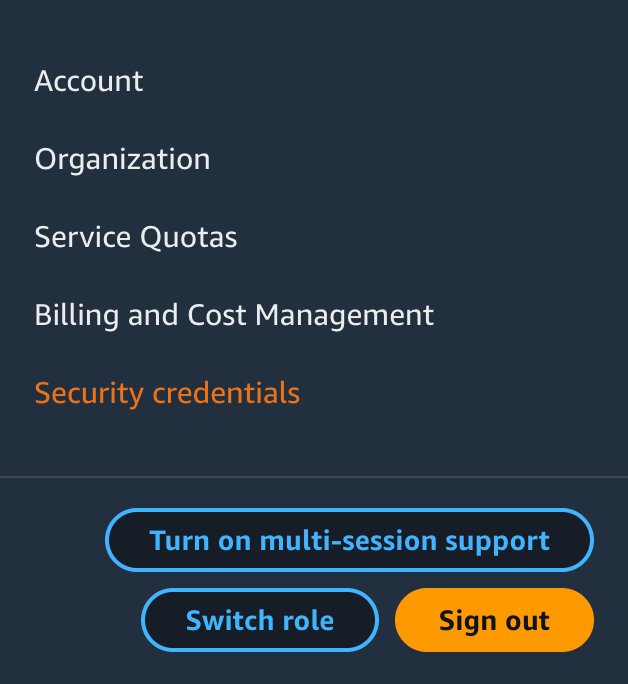
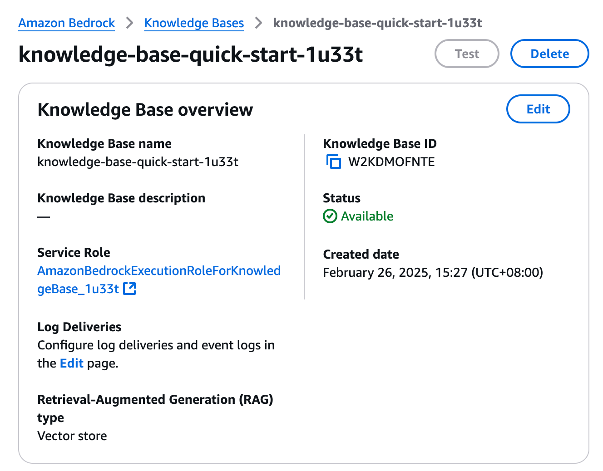
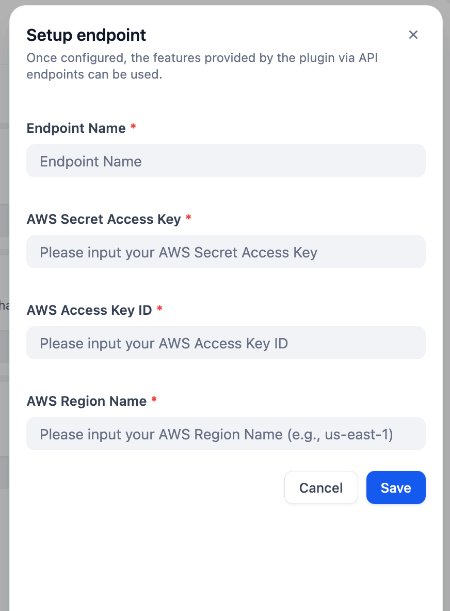
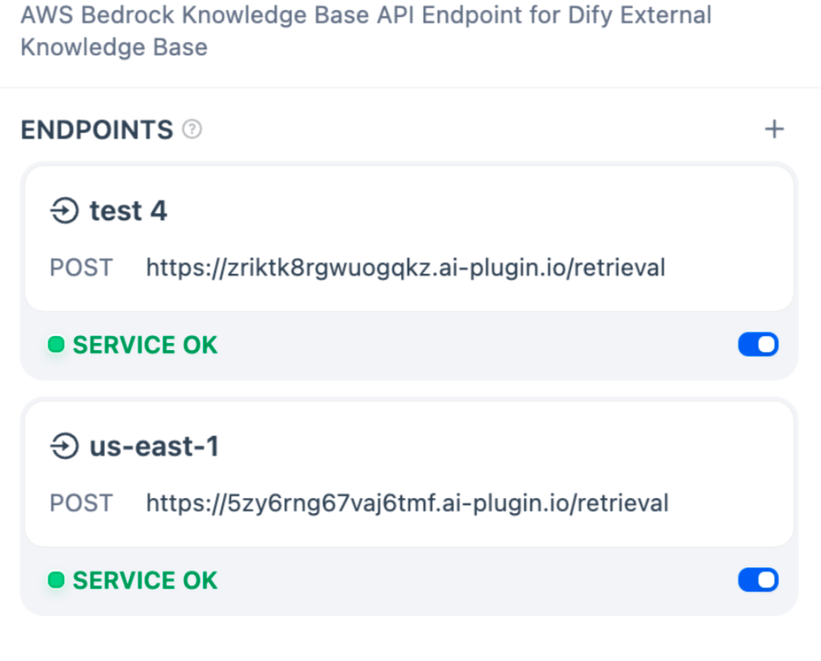
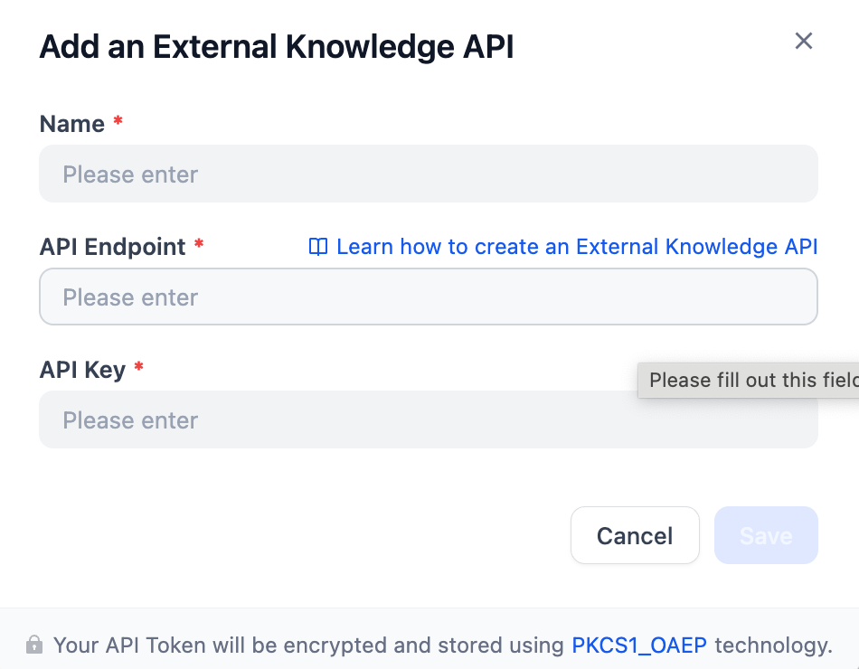
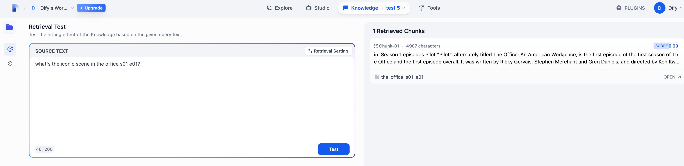

## aws_bedrock_knowledge_base

**Author:** yungler
**Version:** 0.0.1
**Type:** tool

### Description

If you are trying to build AI Agent with context retrieving capability and you are not primarily using Dify's Knowledge Base, you can use Dify's External Knowledge Base to connect with the RAG solution you prefer. This plugin will help you deploy your AWS Bedrock Knowledge Base client as an endpoint so Dify External Knowledge Base can seamlessly connect with it. 

Before we start, make sure you have set up your AWS Bedrock Knowledge Base. You can learn how to use AWS Bedrock Knowledge Base by https://aws.amazon.com/bedrock/knowledge-bases/.

Here's what we need from AWS:

AWS Access Key and AWS Access Key ID. You can get these in the right upper corner,security credential, of your AWS console See https://docs.aws.amazon.com/keyspaces/latest/devguide/create.keypair.html to learn how to get these.

The Knowledge ID of your knowledge base, which you will get when your AWS Bedrock Knowledge Base is configured.

Follow these steps to connect your Dify Knowledge Base with AWS Bedrock Knowledge Base:
1. Go to AWS Bedrock Knowledge Base Endpoint and setup your endpoint with AWS Access Key, AWS Access Key ID, and the Region.

2. Copy the URL of the created endpoint

3. Go to Dify Knowledge Base and click on the right upper corner External Knowledge API. Paste the URL into API Endpoint. Give the endpoint a name. 
**NOTICE: You must REMOVE the "/retrieval" in your URL!!!!!** For API Key, as we didn't configure any authorization, you can type in anything you want. So **PLEASE MAKE SURE NO ONE KNOWS THE ENDPOINT URL!!!**

4. Once it's set up, click on connect to an external knowledge base. Choose the external knowledge API you just created, and put the Knowledge ID here. You can configure the top k and threshold here before connection.

5. Now try a retrieval testing. You can see a chunk is retrieved from your Bedrock Knowledge Base

