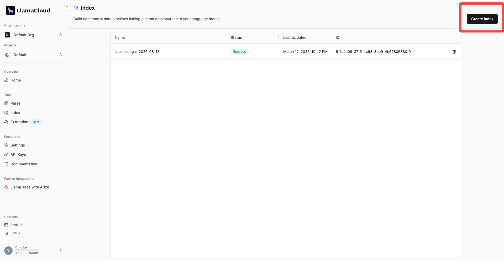
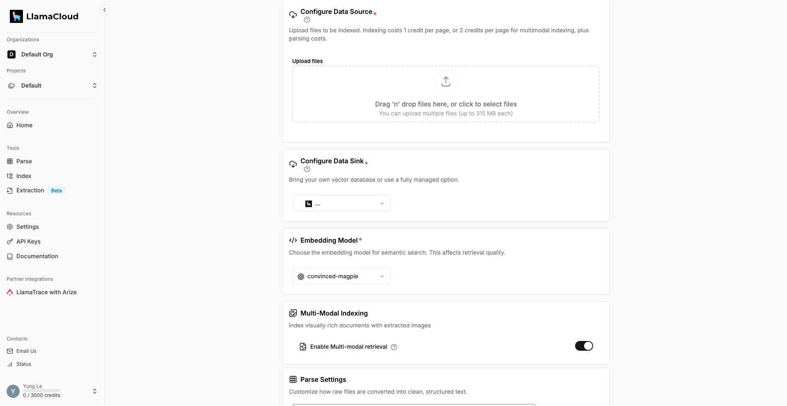
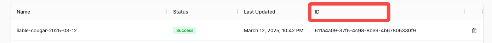
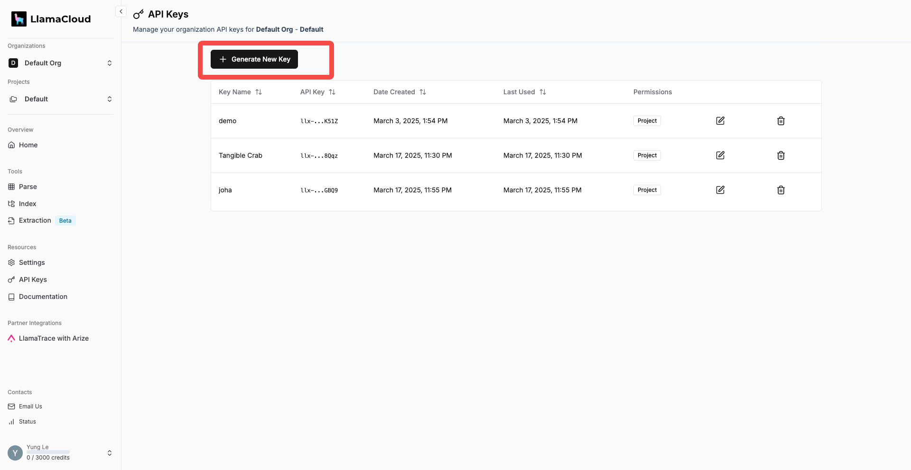
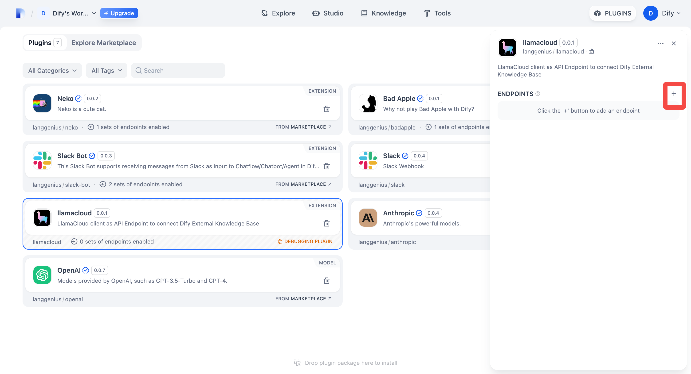
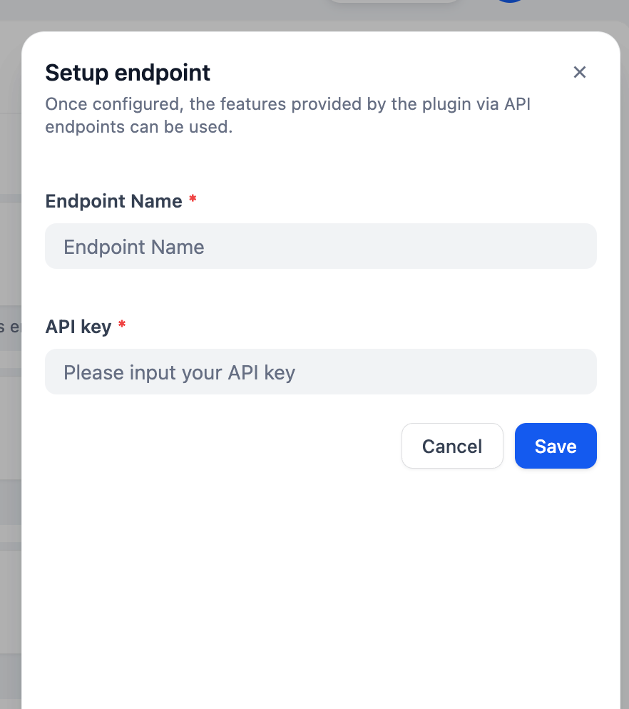
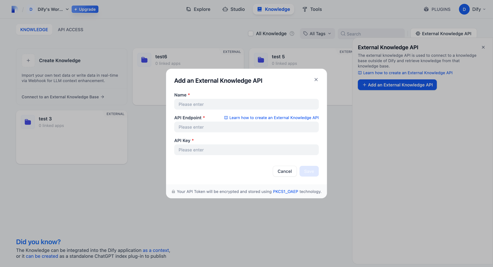
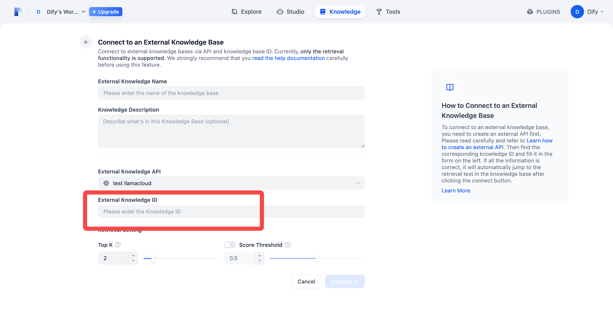
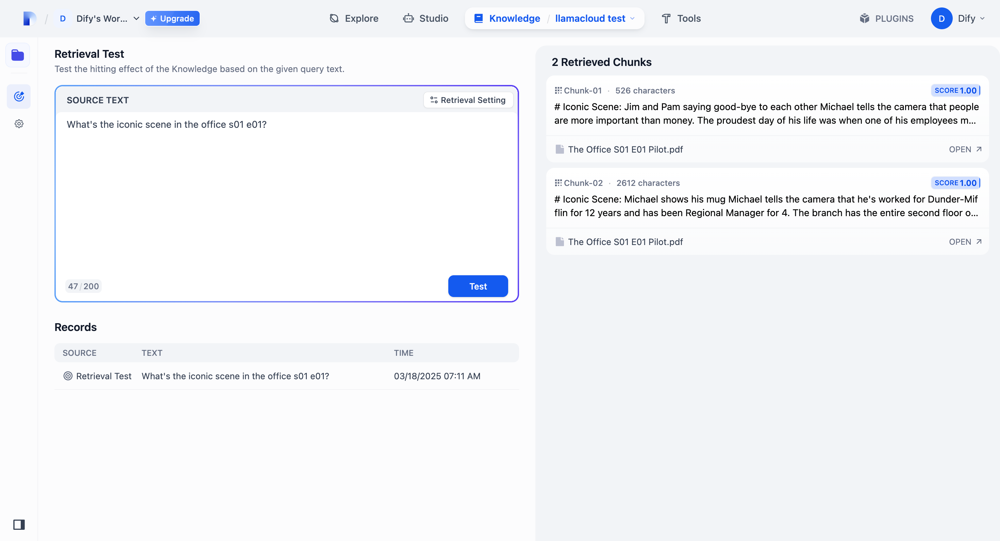

## llamacloud

**Author:** langgenius
**Version:** 0.0.1
**Type:** extension

### Description

LlamaCloud is an online version of LlamaIndex with UI. 

If you are trying to build AI Agent with context retrieving capability and you are not primarily using Dify's Knowledge Base, you can use Dify's External Knowledge Base to connect with the RAG solution you prefer. This plugin will help you deploy your LlamaCloud Index as an endpoint so Dify External Knowledge Base can seamlessly connect with it.

To set up an Index in LlamaCloud, in the **Tools: Index** section, click on Create Index. 

In the Index panel, you can upload your data, connect vector storage and embedding model, configure parse settings.

Once you set up your Index, you will get a Pipeline ID. 

Generate an API Key here:

Now in Dify's marketplace, find LlamaCloud and install it.
Create a new endpoint by clicking here:

Give your endpoint a name, and paste the API Key we just created.

Copy the newly created Endpoint URL, go to Knowledge Base, "External Knowledge API", "Add an External Knowledge API", and paste the URL in "API Endpoint". 

**NOTICE: You must REMOVE the "/retrieval" in your URL!!!!!** For API Key, as we didn't configure any authorization, you can type in anything you want. So **PLEASE MAKE SURE NO ONE KNOWS THE ENDPOINT URL!!!**

Once your external knowledge base is connected, go to "connect to an external knowledge base", type in the Pipeline ID in "Knowledge ID", give it a name, and we are good to go.

Now you can do a retrieval test of your External Knowledge Base.

