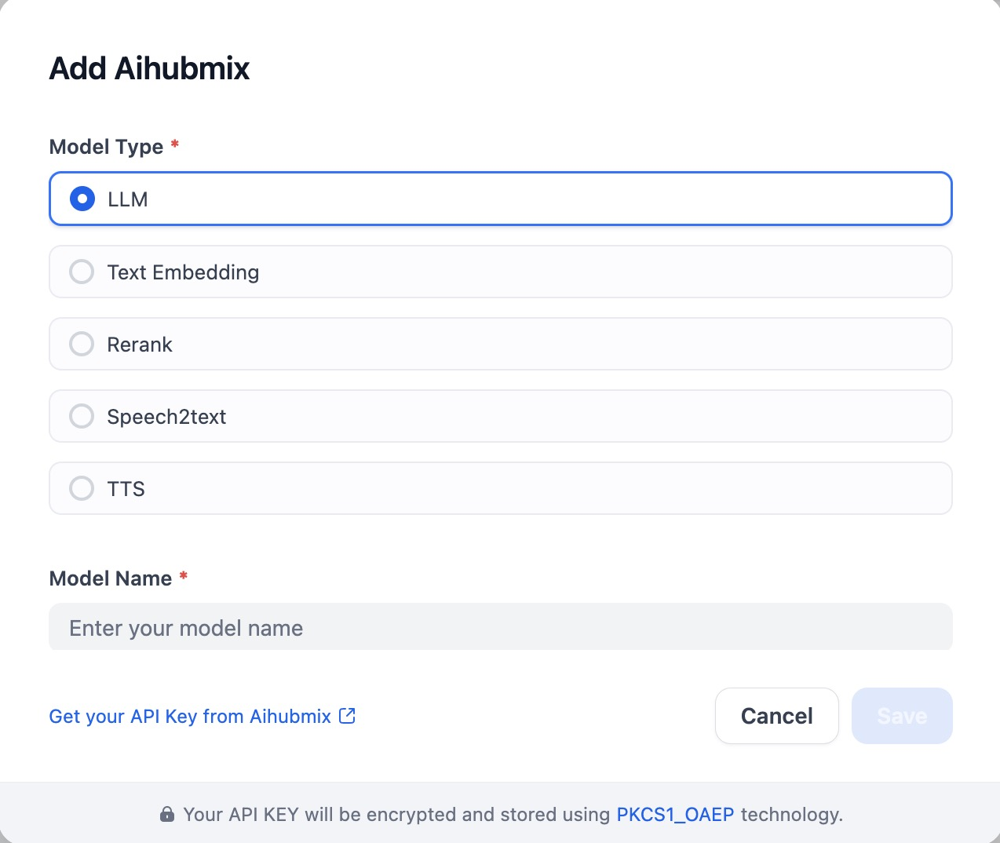

## Overview

Access every major LLM through a single, unified interface. Build smarter, faster.

- **Full Model Coverage**: Connect to all leading AI models including ChatGPT, Claude, Gemini, DeepSeek, and Qwen—all through one consistent format.
- **Unlimited Concurrency**: As authorized partners of Azure, AWS, and Google Cloud, we integrate official APIs alongside our proprietary services for enterprise-grade reliability and unlimited throughput.
- **Enterprise-Ready Performance**: Built on high-performance infrastructure with proven stability in production environments across multiple industries.

## Configure
With the plugin installed, configure AiHubmix by providing the Model Type, Model Name, AiHubmix Endpoint, and API Key. Save in Model Provider.

