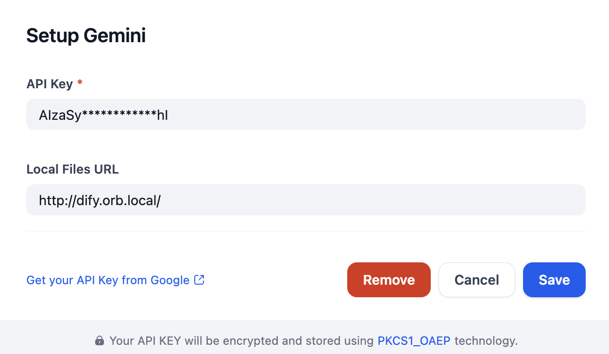

# Overview

- [Configure](#configure)
- [Change Log](#change-log)
  - [0.2.0](#020)

Gemini is a family of multimodal AI models from Google, designed to process and generate various types of data, including text, images, audio, and video. This plugin provides access to Gemini models via a single API key, enabling developers to build versatile multimodal AI applications.

## Configure
After installing the Gemini plugin, configure it with your API key, which you can get from Google. Enter the key in the Model Provider settings and save.

If you use `url` mode for `MULTIMODAL_SEND_FORMAT` in gemeni and other vision models meantime, you can set `Files URL` to gain better performance.

## Change Log

### 0.2.0

BREAKING CHANGE:

- Add support for Gemini Multimodal output.

  Requires Dify version `>=1.3.0`. Older version of Dify should use Gemini version 
  ">=0.1.0,<0.2.0", or dify will encounter error while using Gemini models with multimodal
  capability.
