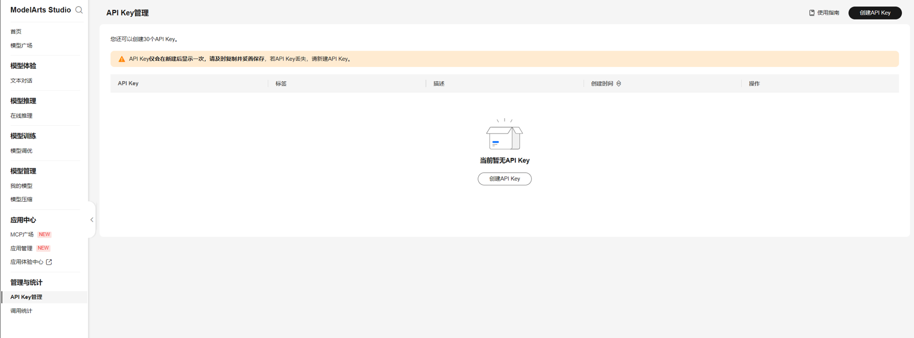
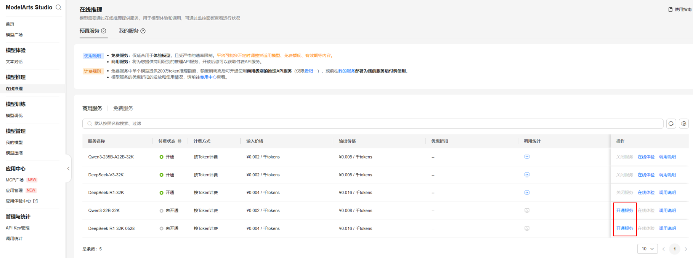

## Overview

通过该插件可接入华为云MaaS平台的模型服务。MaaS集成了业界主流开源大模型，含DeepSeek、Qwen3等模型系列，所有的模型均基于昇腾AI云服务进行全面适配和优化，使得精度和性能显著提升。

## Configure

**1.创建API Key**

-访问贵阳一区域的MaaS控制台：[点此访问](https://console.huaweicloud.com/modelarts/?locale=zh-cn&region=cn-southwest-2#/model-studio/authmanage)

-在MaaS左侧导航栏中，选择“鉴权管理”。

-在“鉴权管理”页面，单击“创建API Key”，填写描述信息后，单击“确认”会返回“您的密钥”，请复制保存密钥，单击“关闭”后将无法再次查看密钥。

> 最多支持创建30个密钥，密钥只会在新建后显示一次，请妥善保存。
> 
> 当密钥丢失将无法找回，请新建API Key获取新的访问密钥。

**2.开通预置模型服务**

点击MaaS控制台左侧“在线推理”，操作一栏中点击“开通服务”。

> 预置模型服务开通后，才可以进行调用，否则会出现报错

**3.添加自定义模型服务（可选）**

- 点击华为云MaaS平台供应商卡片中的添加模型

- 在弹窗中，填入MaaS对应的模型名称、API Key、API Endpoint URL等信息后保存配置
  
  **模型名称：** MaaS服务调用说明中显示的模型名称
  
  **API Key:**  需要使用的API Key
  
  **API Base:** MaaS服务调用说明中的API地址，**<u>需要去掉地址尾部的“/chat/completions”</u>** 后填入
  
  
