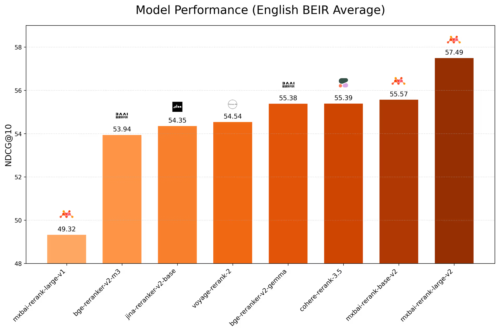

## Overview
MixedBread provides text embedding, and reranking designed for enterprise applications.
Find exactly what you need from your business data with precision and speed.

The latest mxbai-rerank-v2 model works with 100+ languages and all content types and it was tested on English, Chinese, multilingual, tool retrieval, and code-search benchmarks, comparing it to other open- and closed-source models.

The results are impressive outperforming open and closed source competitors such as Cohere or Voyage by a good margin.

## Configure
Install the Mixedbread plugin, then configure it in Model Provider settings with the API Key.
Get your API key from [Mixedbread AI](https://www.mixedbread.com) and save your settings.

