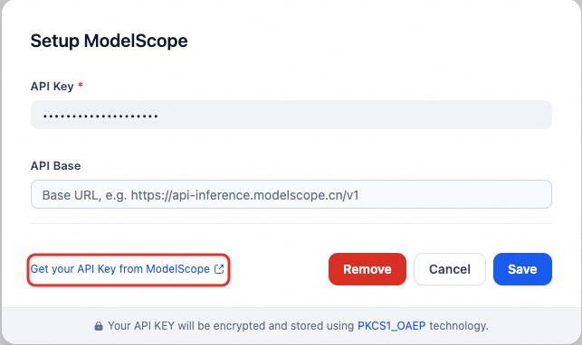

## Overview

This plugin provides access to the models supported by ModelScope community API.

## Configure

After installing the plugin, configure the API key and API base within the Model Provider settings. Obtain your API key from [ModelScope](https://modelscope.cn/docs/model-service/API-Inference/intro). Save to use ModelScope. And remember to bind your Alibaba Cloud account before using the API-Key.

