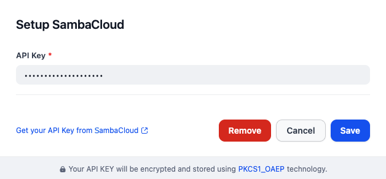

## Overview

SambaNova Cloud is a cloud-based inference platform from SambaNova, Experience the best and fastest open-source models powered by SambaNova RDUs. With this plugin, developers can easily integrate SambaNova Cloud's models, including Llama, Qwen and DeepSeek model families, into applications requiring low latency via it's API.

## Configure

To use SambaNovaCloud, you'll need your [API key](http://cloud.sambanova.ai?utm_source=dify&utm_medium=external&utm_campaign=cloud_signup) . After installing the plugin, find the Model Provider settings and enter the key you obtained from SambaNova Cloud. Save to activate.

