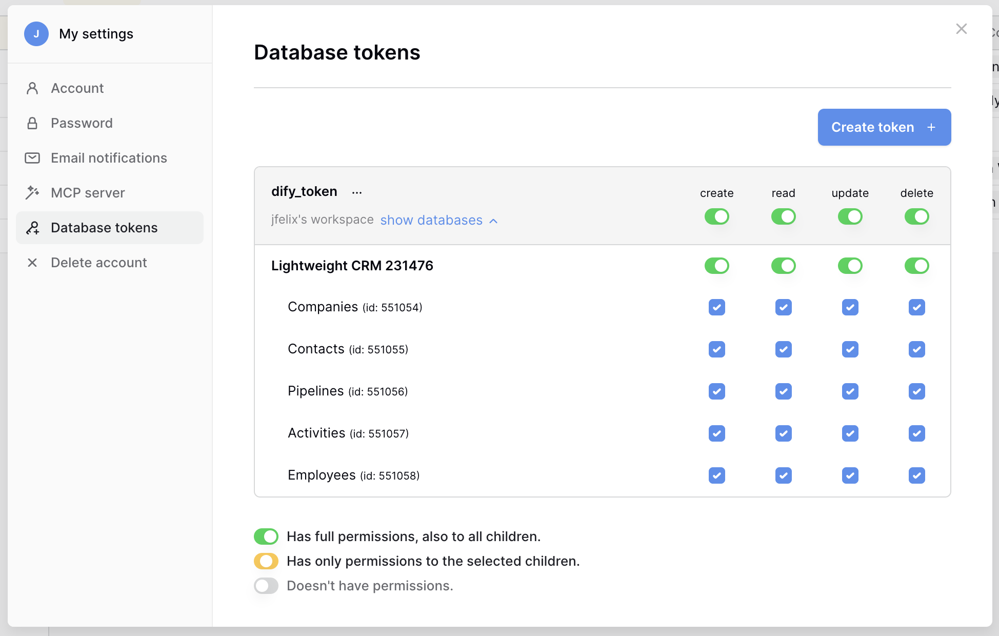
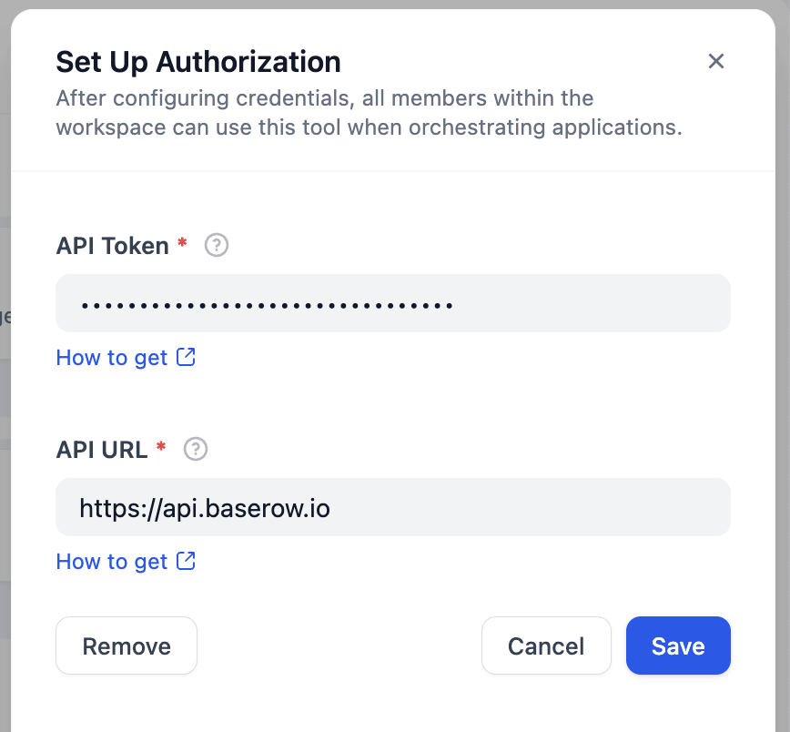
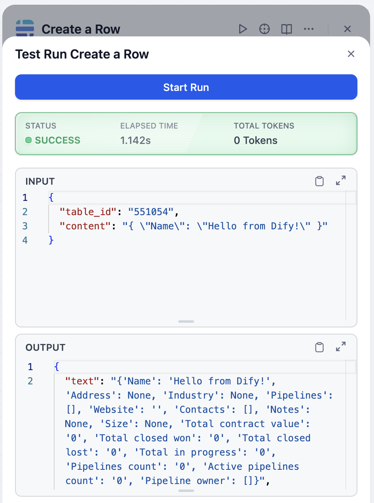
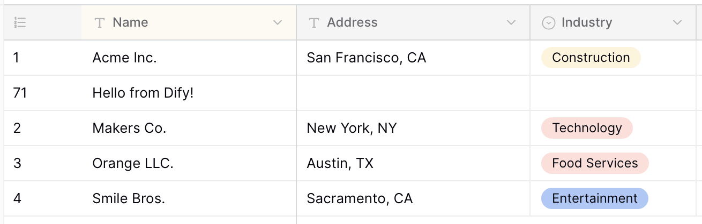

## dify-plugin-baserow

**Author:** langgenius
**Version:** 0.0.1
**Type:** tool

### Description

Baserow is an open-source online database tool. This plugin allows you to create and manage rows using Baserow's API.

### Tools

- `get_tables`: Retrieve a list of tables.

- `get_rows`: Retrieve rows from a specified table.
    - `table_id`: The ID of the table from which to retrieve rows.

- `get_a_row`: Retrieve a specific row from a specified table.
    - `table_id`: The ID of the table from which to retrieve the row.
    - `row_id`: The ID of the row to retrieve.

- `create_row`: Create a new row in a specified table.
    - `table_id`: The ID of the table in which to create the row.
    - `content`: The data for the new row, formatted as a json object. For example: `{"name": "John Doe", "age": 30}`.

- `update_row`: Update an existing row in a specified table.
    - `table_id`: The ID of the table containing the row to update.
    - `row_id`: The ID of the row to update.
    - `content`: The updated data for the row, formatted as a json object. For example: `{"name": "Jane Doe", "age": 31}`.

### Usage

1. Get your database token
    - Open the Baserow database you want to use.
    - Create a new API token in the Baserow settings.

2. Set up the plugin
    - Go to the plugin settings in your application.
    - Enter the Baserow API token you created.
    - Specify the base URL for your Baserow instance (e.g., `https://api.baserow.io`).

3. Use the plugin
    - Call the plugin methods to interact with your Baserow database.
    - For example, to create a new row, use the `create_row` method with the appropriate `table_id` and `content`.

### Privacy Policy

Check [PRIVACY.md](PRIVACY.md) for details on how your data is handled.

Last updated: 2025-05-29
