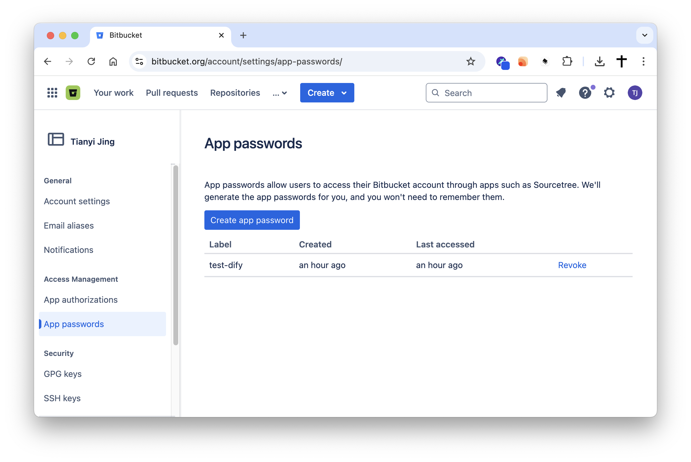
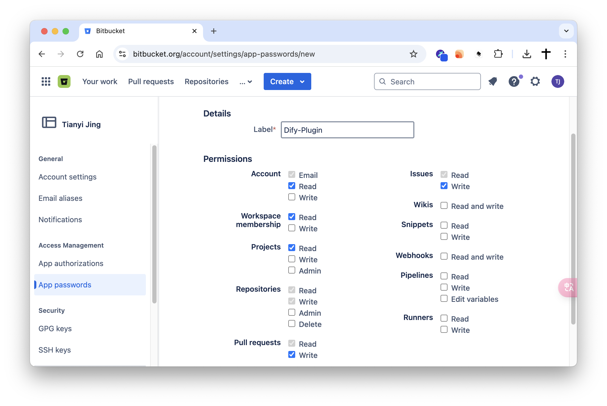
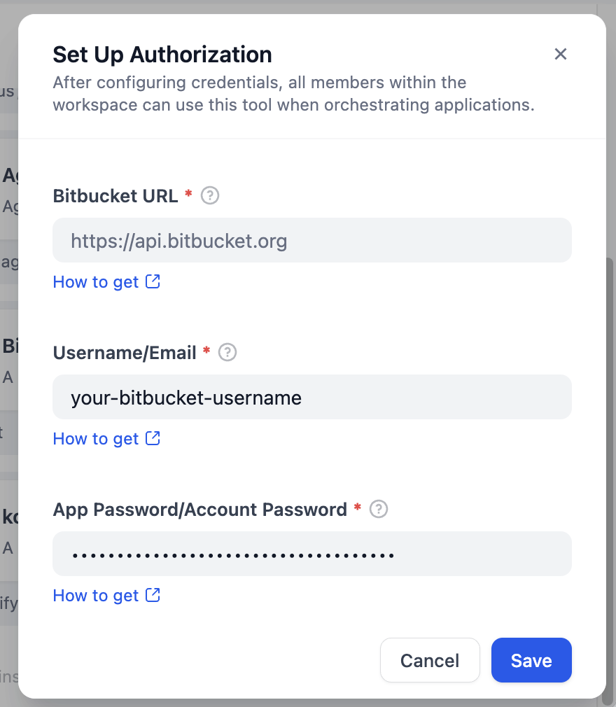
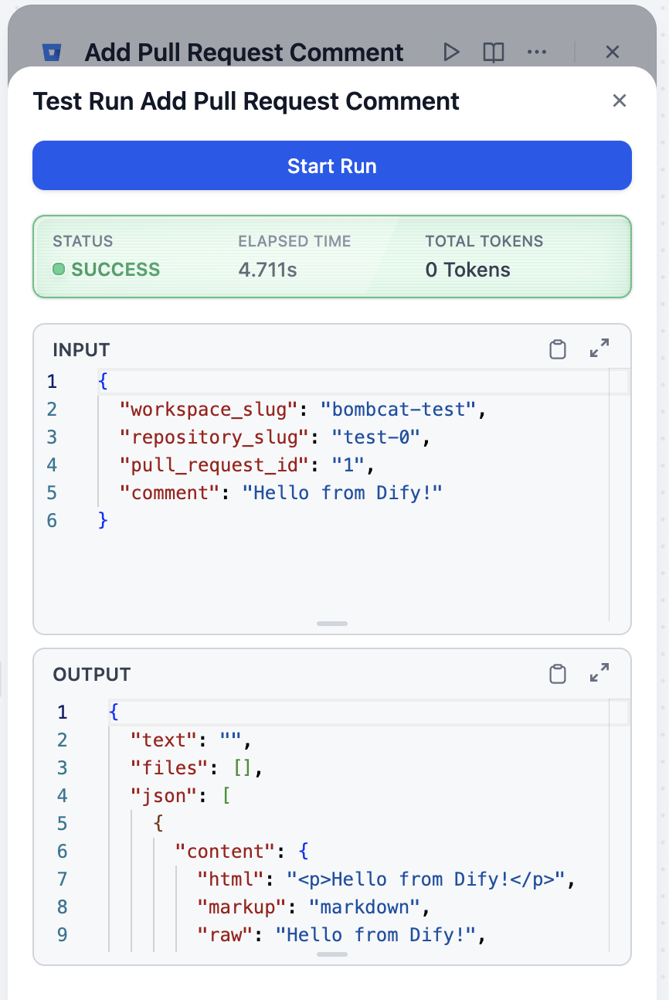
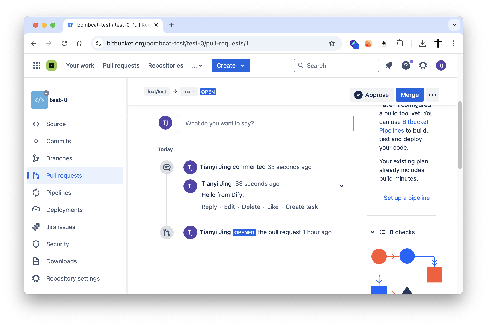

## Dify Plugin for Bitbucket

### Description

This Dify plugin allows you to interact with the Bitbucket API, enabling you to perform various actions such as acquiring info from repositories, projects, pull requests. The plugin is designed to facilitate seamless integration with Bitbucket's features and functionalities.

### Tools

### Features

This plugin provides the following functionalities:

*   **Workspace Management:**
    *   List accessible workspaces (`list_workspace`).
    *   Get details of a specific workspace (`get_workspace`).
*   **Repository Management:**
    *   List repositories within a workspace (`list_repository`).
    *   Get details of a specific repository (`get_repository`).
*   **Pull Request Management:**
    *   List pull requests in a repository (`list_pull_request`).
    *   Get details of a specific pull request (`get_pull_request`).
    *   Add comments to a pull request (`add_pull_request_comment`).

### Setup

1. Get your Bitbucket API credentials at [Bitbucket App Password](https://bitbucket.org/account/settings/app-passwords/)

2. Create a new app password with the required permissions as follows:

3. Authenticate the plugin with your Bitbucket username using the app password you created.

    > Note that there are two authentication methods available: Bitbucket username + App Password or Email + Password. Choose the one that suits you best. You can get your Bitbucket username at [Account settings](https://bitbucket.org/account/settings/). We recommend using the App Password method for better security.

    

4. Enjoy the plugin!

    
    

### Privacy Policy

Check the [Privacy Policy](PRIVACY.md) for more information on how we handle your data.
