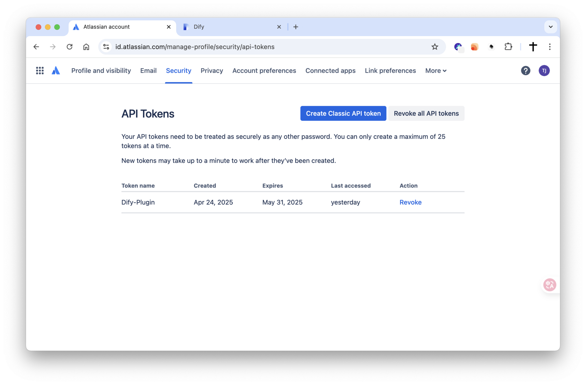
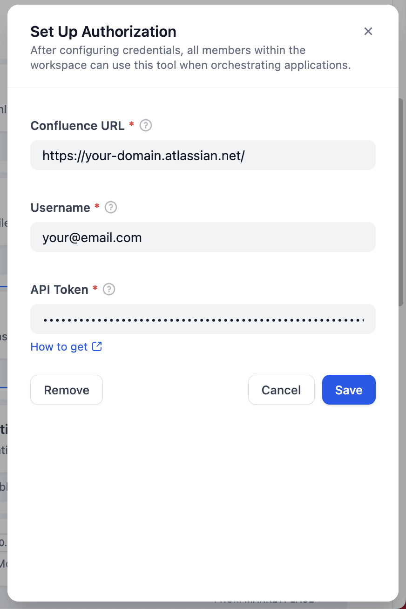
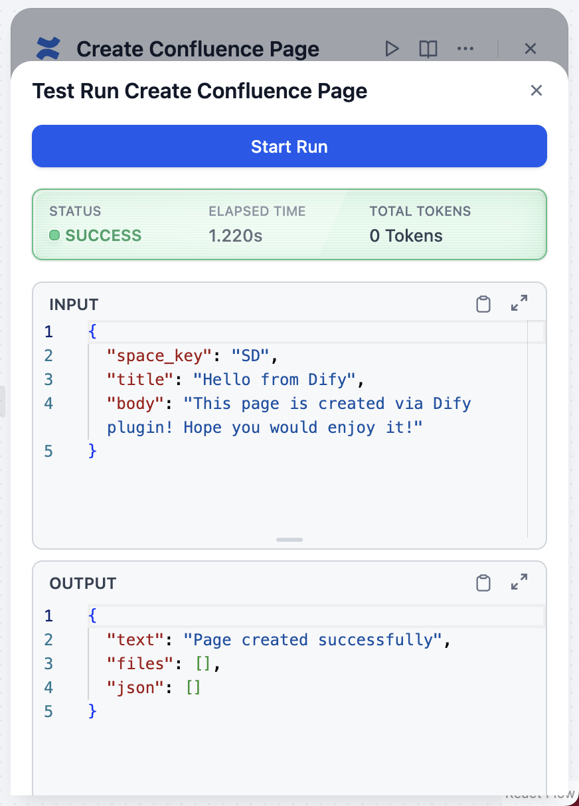
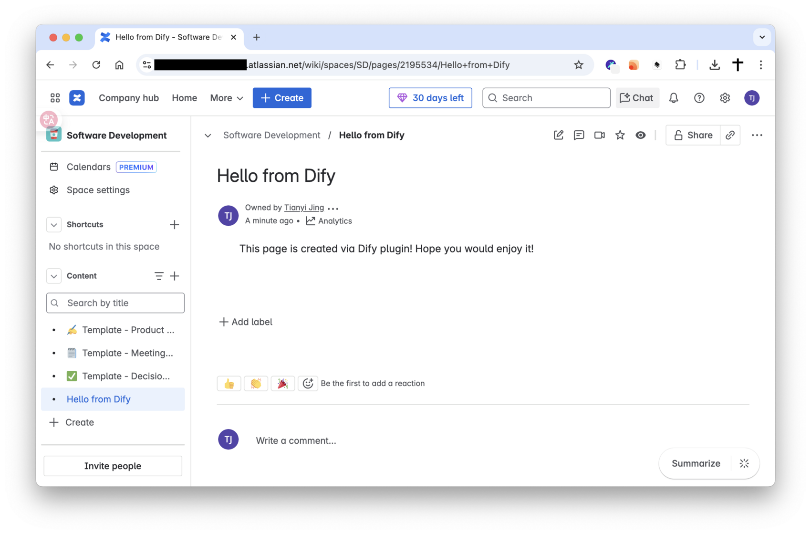

## Dify Plugin for Confluence

### Description

This Dify plugin allows you to interact with your Confluence instance, enabling you to perform various actions such as managing spaces and pages. The plugin is designed to facilitate seamless integration with Confluence's features and functionalities.

### Tools

This plugin provides the following functionalities:

*   **Space Management:**
    *   List accessible spaces (`list_space`).
    *   Get details of a specific space (`get_space`).
*   **Page Management:**
    *   List pages within a space (`list_page_of_space`).
    *   Get content and details of a specific page (`get_page`).
    *   Create a new page (`create_page`).
    *   Remove a page (`remove_page`).

### Setup

1.  **Get your Atlassian API Token:**
    *   Navigate to your Atlassian account settings: [https://id.atlassian.com/manage-profile/security/api-tokens](https://id.atlassian.com/manage-profile/security/api-tokens)
    *   Click "Create Classic API token".
    *   Give your token a descriptive label (e.g., "Dify Confluence Plugin").
    *   Copy the generated API token immediately. You won't be able to see it again.

2.  **Configure the Plugin in Dify:**
    *   When adding the Confluence plugin in Dify, you will be prompted for:
        *   **Confluence URL:** Your Confluence instance URL (e.g., `https://your-domain.atlassian.net/`).
        *   **Username:** Your Confluence account username (usually your email address).
        *   **API Token:** The API token you created in step 1.

    *   Enter these details to authenticate the plugin.

    

3.  **Enjoy the plugin!** You can now use the Confluence tools within your Dify applications.

    
    

### Privacy Policy

Check the [Privacy Policy](PRIVACY.md) for more information on how we handle your data.
