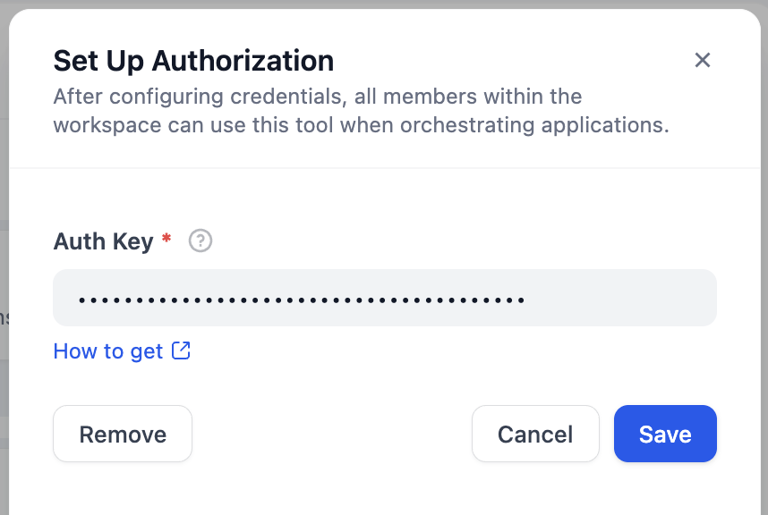
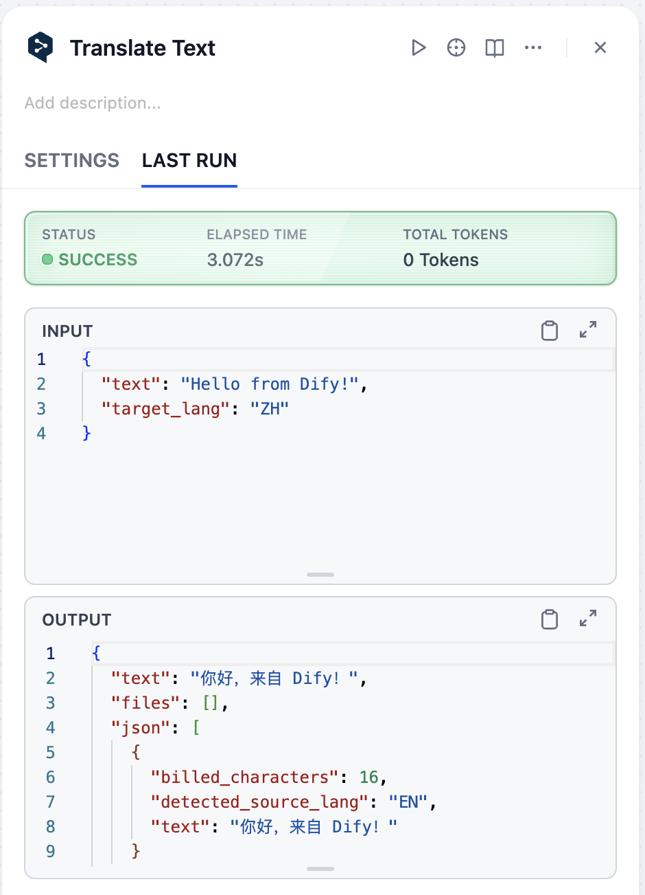

## dify-plugin-deepl

**Author:** langgenius

**Version:** 0.0.1

**Type:** tool

### Description

DeepL is a powerful text translation and rephrasing tool based on DeepL's advanced AI translation technology. This plugin provides high-quality text translation and natural language rephrasing capabilities, supporting translation between multiple languages.

### Tools

#### 1. Translate Text

**Description**: Translate text from one language to another

**Parameters**:
- **text** (Required)
  - Type: String
  - Description: The text content to be translated
  - Example: "Hello, how are you?"

- **source_lang** (Optional)
  - Type: String
  - Description: Source language code. If not provided, DeepL will automatically detect the source language
  - Format: Use ISO 639-1 language codes
  - Example: "EN" (English), "DE" (German), "FR" (French), "ZH" (Chinese), "JA" (Japanese)

- **target_lang** (Required)
  - Type: String
  - Description: Target language code
  - Format: Use ISO 639-1 language codes
  - Example: "EN" (English), "DE" (German), "FR" (French), "ZH" (Chinese), "JA" (Japanese)

**Returns**:
- Translated text
- Detected source language
- Billed characters count

#### 2. Rephrase Text

**Description**: Rephrase text to make it more natural and fluent

**Parameters**:
- **text** (Required)
  - Type: String
  - Description: The text content to be rephrased
  - Example: "The weather is good today."

- **target_lang** (Required)
  - Type: String
  - Description: Target language code
  - Format: Use ISO 639-1 language codes
  - Example: "EN" (English), "DE" (German), "FR" (French), "ZH" (Chinese), "JA" (Japanese)

**Returns**:
- Rephrased text
- Detected source language
- Billed characters count

### Configuration Requirements

**Authentication Key (Auth Key)**:
- Type: Secret input
- Required: Yes
- How to get: Visit [DeepL Account Page](https://www.deepl.com/en/your-account/keys) to obtain your authentication key
- Description: This is the required authentication information for using DeepL services

### Usage Examples

### Privacy Notice

This plugin uses DeepL's API services for text translation and rephrasing. Please refer to [PRIVACY.md](PRIVACY.md) for detailed privacy policy.

### License

Please refer to [LICENSE](LICENSE) file for license information.

Last update: 2025-07-09
