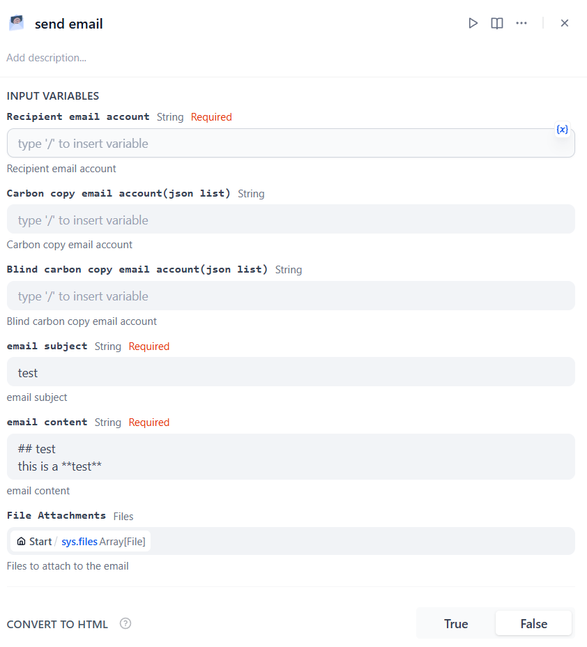

# Email

## Overview

The email is a method of electronic communication for sending and receiving information through the Internet. This tool helps users to send emails to one person or to multiple recipients with support for CC, BCC, file attachments, and markdown-to-HTML conversion.

## Configuration

### 1. Get email tools from Plugin Marketplace

The email tools could be found at the Plugin Marketplace, please install it first.

### 2. Fill in the configuration in Dify

On the Dify navigation page, click `Tools > email > To authorize`.

**Note**: If your email account is gmail, please use "START TLS" as encrypt method, the smtp server is smtp.gmail.com, and the port is 587. For other common email service settings, please check this [manual](https://docs.mattermost.com/configure/smtp-email.html#sample-smtp-settings).

### 3. Use the tool

You can use the email tool in the following application types.

#### Chatflow / Workflow applications
Both Chatflow and Workflow applications support adding a `email` tool node.

### 4. Advanced Features

#### CC and BCC Recipients
You can include carbon copy (CC) and blind carbon copy (BCC) recipients to your emails. These should be formatted as JSON arrays of email addresses.

#### File Attachments
The tool supports attaching files to your emails. You can include multiple file attachments that will be sent along with your email message.

#### Markdown to HTML Conversion
Enable the "Convert to HTML" option to automatically convert your markdown-formatted email content to properly formatted HTML, making your emails more visually appealing. The conversion supports:

- Rich text formatting (bold, italic, headers)
- Links and inline code blocks
- Tables with proper formatting
- Inline images that can be embedded directly in the email body

