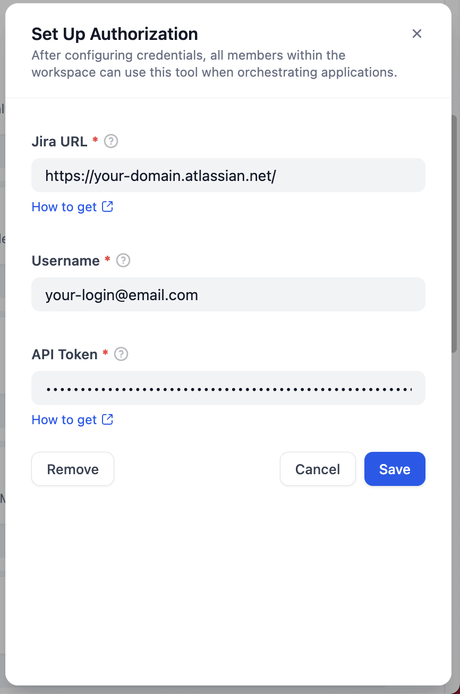
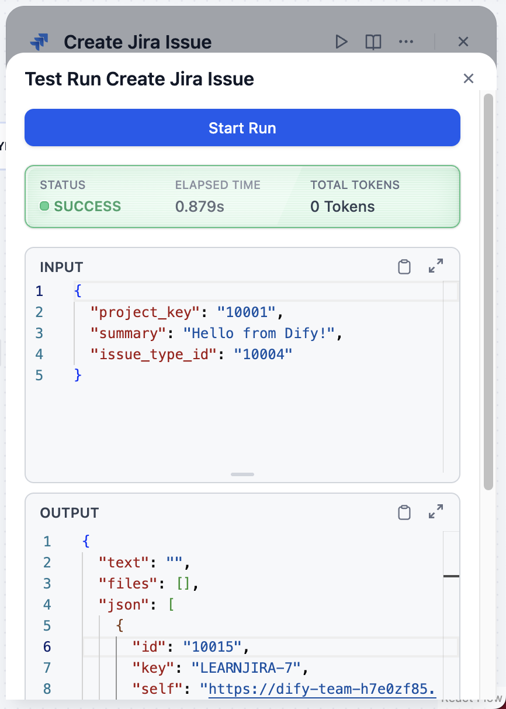
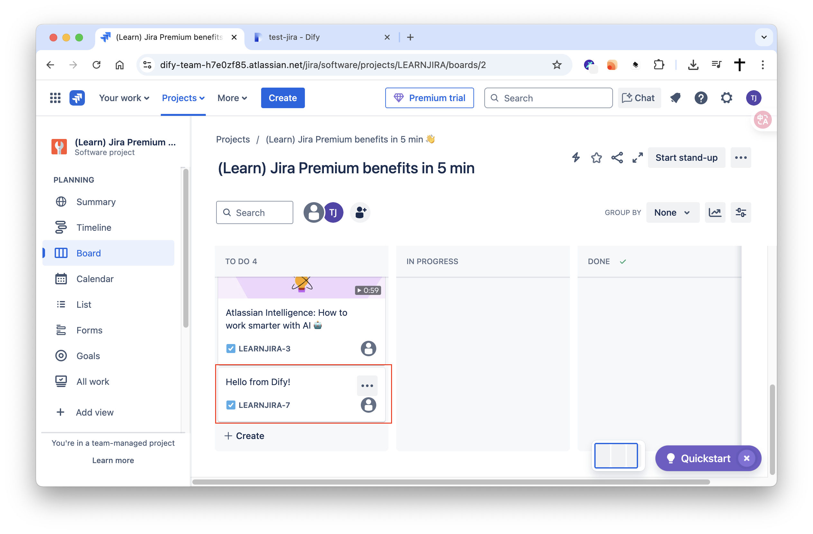

## Dify Plugin for Jira

### Description

This Dify plugin allows you to interact with your Jira instance, enabling you to perform various actions such as managing projects, boards, and issues. The plugin is designed to facilitate seamless integration with Jira's features and functionalities.

### Tools

This plugin provides the following functionalities:

*   **Project Management:**
    *   List accessible projects (`list_projects`).
    *   Get details of a specific project (`get_project`).
*   **Board Management:**
    *   List boards within a project (`list_boards`).
    *   Get details of a specific board (`get_board`).
*   **Issue Management:**
    *   List issues for a specific board (`list_issues_for_board`).
    *   Get details of a specific issue (`get_issue`).
    *   Create a new issue (`create_issue`).
    *   Delete an issue (`delete_issue`).
    *   List issue types for a project (`list_issues_type`).

### Setup

1.  **Get your Jira API Token:**
    *   Navigate to your Atlassian account settings: [https://id.atlassian.com/manage-profile/security/api-tokens](https://id.atlassian.com/manage-profile/security/api-tokens)
    *   Click "Create API token".
    *   Give your token a descriptive label (e.g., "Dify Plugin").
    *   Copy the generated API token immediately. You won't be able to see it again.

2.  **Configure the Plugin in Dify:**
    *   When adding the Jira plugin in Dify, you will be prompted for:
        *   **Jira URL:** Your Jira instance URL (e.g., `https://your-domain.atlassian.net`).
        *   **Username:** Your Jira account username (usually your email address).
        *   **API Token:** The API token you created in step 1.

    *   Enter these details to authenticate the plugin.

    

3.  **Enjoy the plugin!** You can now use the Jira tools within your Dify applications.

    
    

### Privacy Policy

Check the [Privacy Policy](PRIVACY.md) for more information on how we handle your data.
