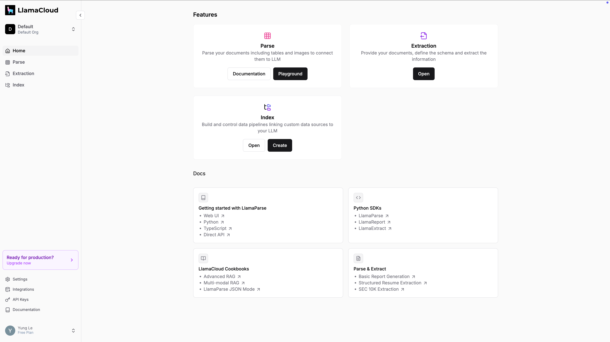
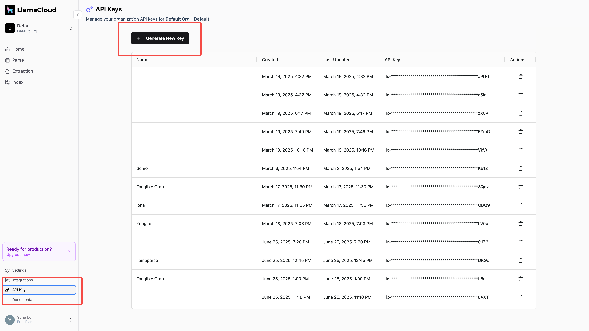

# LlamaParse Dify Plugin

LlamaParse is a GenAI-native document parser that can parse complex document data for any downstream LLM use case (RAG, agents). This plugin integrates LlamaParse capabilities into the Dify platform.



## Features

✅ **Broad file type support**: Parse various unstructured file types (.pdf, .pptx, .docx, .xlsx, .html) with text, tables, visual elements, and complex layouts.

✅ **Table recognition**: Accurately parse embeddLed tables into text and semi-structured representations.

✅ **Multimodal parsing**: Extract visual elements (images/diagrams) into structured formats using the latest multimodal models.

✅ **Custom parsing**: Customize output through custom prompt instructions.

✅ **Advanced LLM Mode**: Enhanced parsing with LLM-powered layout reconstruction, target pages, max pages, and custom prompts.


## Tools Included

This plugin provides two tools:

### 1. Llama Parse (Standard)
The standard LlamaParse tool with basic parsing capabilities.


### 2. Llama Parse Advanced (LLM Mode)
An advanced version with enhanced features:
- **LLM Mode**: Uses `parse_mode="parse_page_with_llm"` for better layout reconstruction
- **Target Pages**: Parse specific pages using comma-separated page numbers (e.g., "0,2,7")
- **Max Pages**: Limit the maximum number of pages to parse
- **System Prompt**: Override default LlamaParse system prompt (use with caution)
- **User Prompt**: Transform or modify parsed content (e.g., translation, summarization)


## Getting Started

### API Key Setup

1. Visit [https://cloud.llamaindex.ai/api-key](https://cloud.llamaindex.ai/api-key) to create an account
2. Generate your API key
3. Configure the API key in your Dify plugin settings




### Configuration Setup

For file upload functionality, configure the `FILES_URL` environment variable in your Dify `.env` file:

- **Docker Compose**: `FILES_URL=http://api:5001`
- **Other deployments**: `FILES_URL=http://YOUR_DIFY_HOST_IP:5001`


### Usage Limits

- Free plan: Up to 1000 pages per day
- Paid plan: 7000 free pages per week + $0.003 per additional page

## Parameters

### Standard Tool Parameters

| Parameter   | Type    | Required | Default  | Description                                              |
| ----------- | ------- | -------- | -------- | -------------------------------------------------------- |
| files       | files   | Yes      | -        | Files to be parsed                                       |
| result_type | select  | No       | markdown | Output format (txt or md)                                |
| num_workers | number  | No       | 4        | Number of parallel workers for processing multiple files |
| verbose     | boolean | No       | false    | Enable detailed output logging                           |
| language    | string  | No       | "en"     | Output language (e.g., "en" for English)                 |

### Advanced Tool Parameters

The advanced tool includes all standard parameters plus:

| Parameter      | Type    | Required | Default | Description                                              |
| -------------- | ------- | -------- | ------- | -------------------------------------------------------- |
| target_pages   | string  | No       | -       | Specific pages to parse (e.g., "0,2,7")                 |
| max_pages      | number  | No       | -       | Maximum number of pages to parse                         |
| system_prompt  | string  | No       | -       | Custom system prompt (use with caution)                  |
| user_prompt    | string  | No       | -       | Custom user prompt for content transformation            |

## Usage Examples

### Standard Tool
```python
# Basic parsing
result = llama_parse(
    files=[document.pdf],
    result_type="markdown"
)
```

### Advanced Tool
```python
# Parse specific pages with custom prompts
result = llama_parse_advanced(
    files=[document.pdf],
    result_type="markdown",
    target_pages="0,2,7",
    max_pages=10,
    system_prompt="Output as structured report",
    user_prompt="Translate to English if not already in English"
)
```

## Output Format

The plugin provides three types of output for each processed file:

1. **Text Message**

   - Plain text concatenation of all parsed documents, separated by "---"

2. **JSON Message**

   - Structure: `{ filename: [{ text: string, metadata: object }] }`
   - Contains parsed text and associated metadata for each document

3. **Blob Message**
   - Binary content with appropriate MIME type:
     - JSON: "application/json"
     - Markdown: "text/markdown"
     - Text: "text/plain"

## Credits

This plugin is powered by [LlamaParse](https://github.com/run-llama/llama_cloud_services/tree/main/llama_parse), a powerful document parsing service by LlamaIndex.
