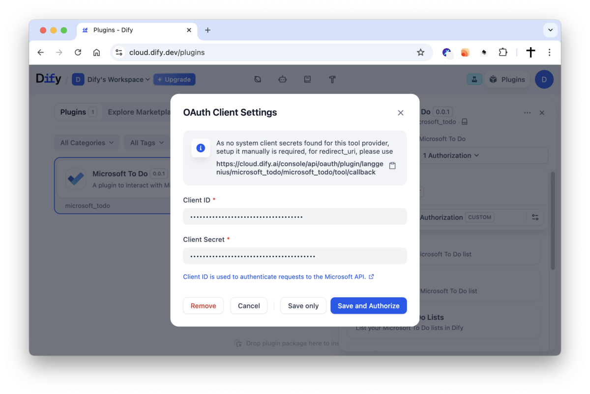
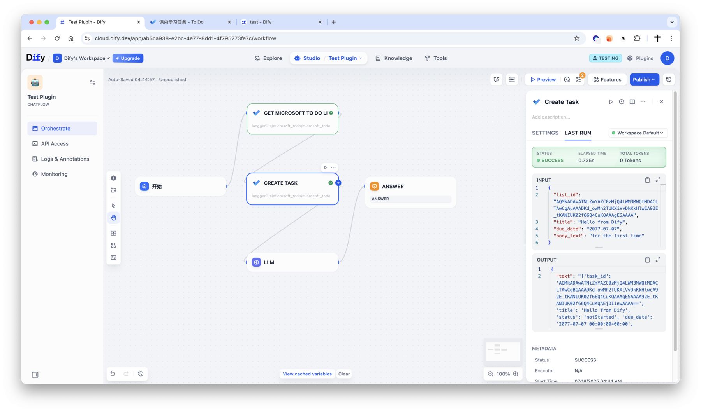
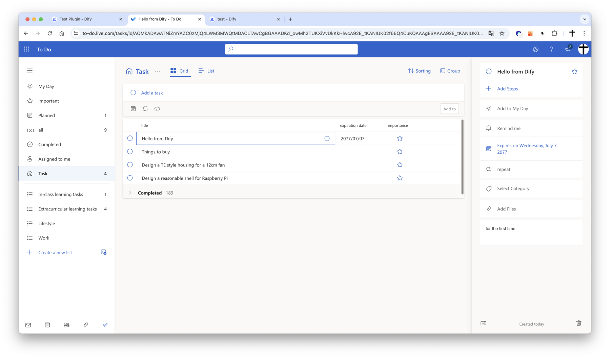

# Microsoft To Do Plugin

**Author**: langgenius
**Version**: 0.0.1
**Type**: tool

## Introduction

This plugin integrates with Microsoft To Do, supporting operations such as retrieving, creating, and completing tasks. It enables automated management of your to-do items in platforms like Dify.

## Setup

1. Register your application in the [Microsoft Azure Portal](https://portal.azure.com/#view/Microsoft_AAD_RegisteredApps/ApplicationsListBlade).

    

2. Create a new application as follows:
    - **Name**: Dify To Do Plugin
    - **Supported account types**: select `Accounts in any organizational directory (Any Microsoft Entra ID tenant - Multitenant) and personal Microsoft accounts (e.g. Skype, Xbox)`
    - **Redirect URI**: Choose `Web` and set the URI to:
        - For SaaS (cloud.dify.ai) users: please use `https://cloud.dify.ai/console/api/oauth/plugin/langgenius/microsoft_todo/microsoft_todo/tool/callback`
        - For self-hosted users: please use `http://<YOUR LOCALHOST CONSOLE_API_URL>/console/api/oauth/plugin/langgenius/microsoft_todo/microsoft_todo/tool/callback`
        ***Due to the restrictions of the Microsoft OAuth2 flow, redirect URIs must start with `https://` or `http://localhost`.***
        - Enable "Access tokens" and "ID tokens" under "Implicit grant and hybrid flows"

        

3. Copy your **Application (client) ID**

    

4. Create a new client secret:
    - **Description**: Dify To Do Plugin Secret
    - **Expires**: Whatever duration you prefer (e.g., 1 year, 2 years, etc.)
    - Copy the generated **Value** of the client secret.

    

5. Configure the plugin in Dify:
    - Fill in the **Client ID** and **Client Secret** fields with the values you copied from the Azure Portal.
    - Make sure you have the same redirect URI as specified in the Azure Portal. If not, you will need to update it in the Azure Portal.
    - Click `Save and authorize` to initiate the OAuth flow.

    

6. Enjoy using the Microsoft To Do plugin in Dify!

    
    

## Tool Descriptions

### get_lists
Retrieve all Microsoft To Do lists for the current user.

### get_list_by_id
Retrieve a specific Microsoft To Do list by its list ID.

**Parameters:**
- list_id (string): The ID of the list to retrieve.

### get_all_tasks
Retrieve all tasks from all lists.

### get_tasks
Retrieve all tasks from all lists (similar to get_all_tasks).

### get_task_by_id
Retrieve a specific task by its task ID and list ID.

**Parameters:**
- task_id (string): The ID of the task to retrieve.
- list_id (string): The ID of the list the task belongs to.

### get_tasks_by_list_id
Retrieve all tasks under a specific list by list ID.

**Parameters:**
- list_id (string): The ID of the list to retrieve tasks from.

### create_task
Create a new task in the specified list.

**Parameters:**
- list_id (string): The ID of the list to create the task in.
- title (string): The title of the task.

### complete_task
Mark a specific task as completed.

**Parameters:**
- task_id (string): The ID of the task to complete.
- list_id (string): The ID of the list the task belongs to.

## RPIVACY

Please refer to the [Privacy Policy](PRIVACY.md) for information on how your data is handled when using this plugin.

Last updated: July 18, 2025
