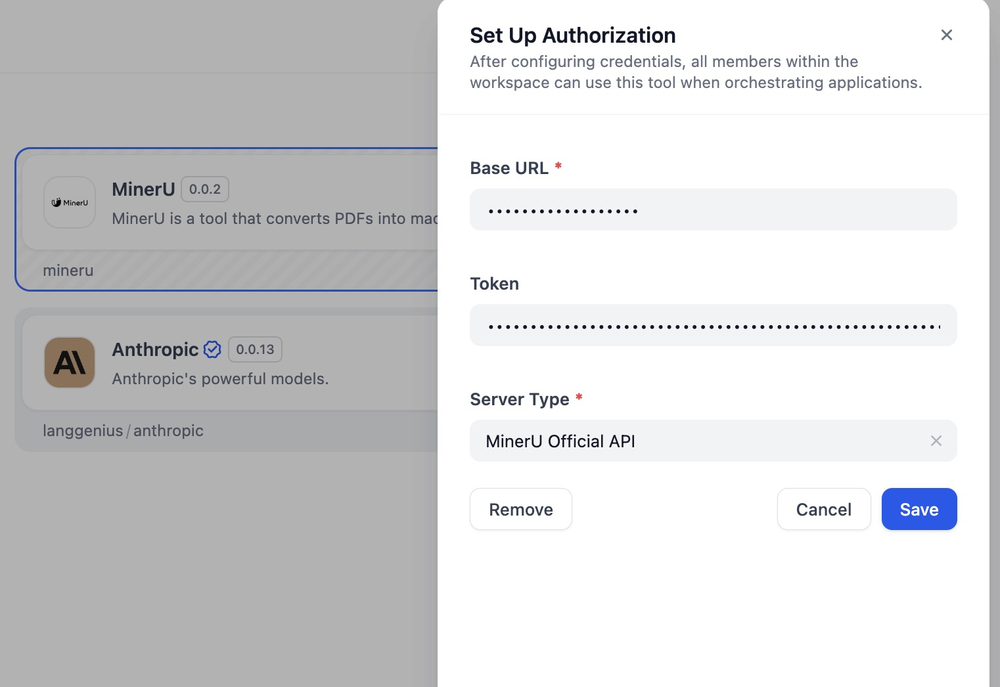
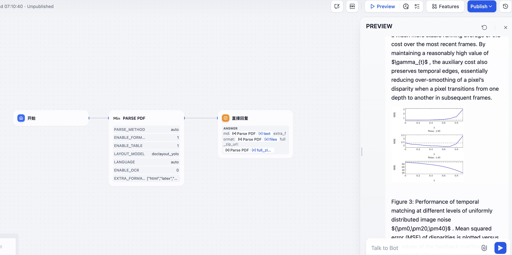
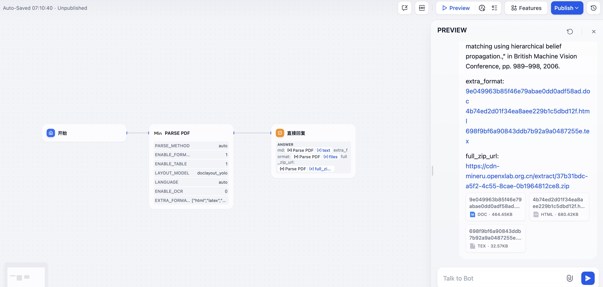
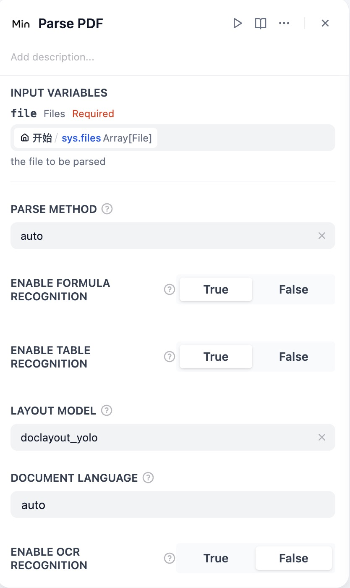
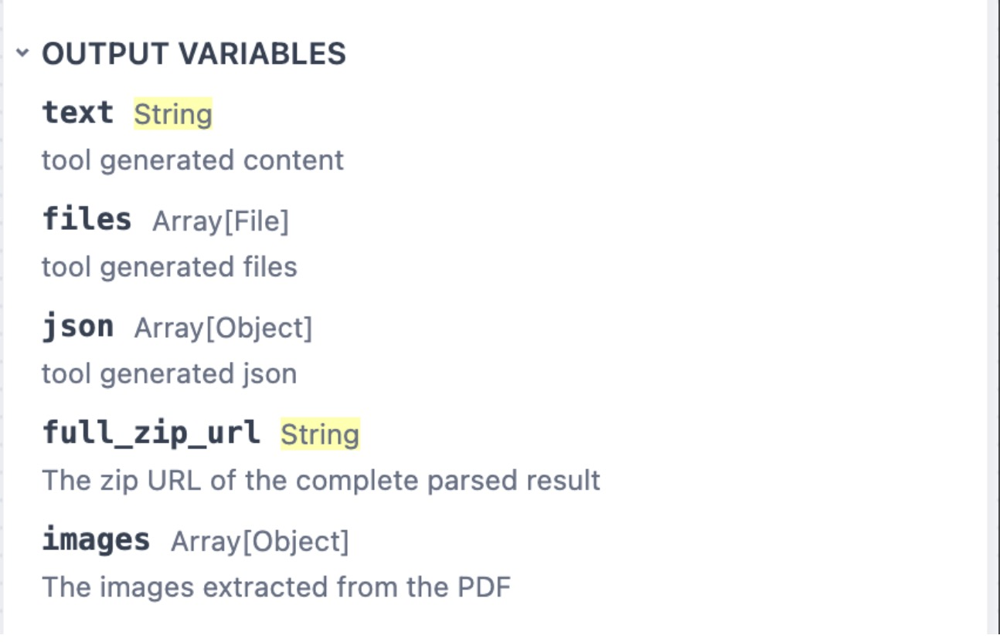
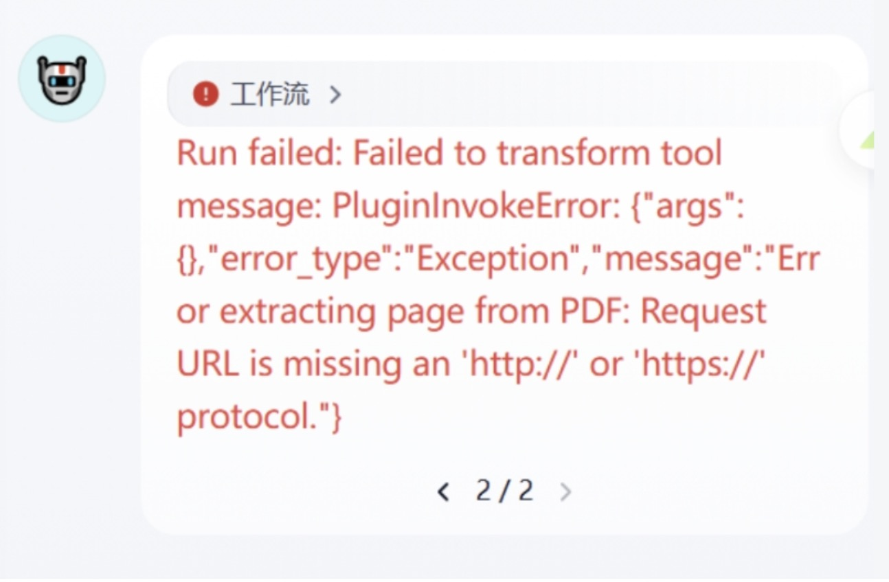

# MinerU Dify Plugin

## GitHub

MinerU is a tool that converts PDFs into machine-readable formats (e.g., markdown, JSON), allowing for easy extraction into any format.

MinerU is a document parser that can parse complex document data for any downstream LLM use case (RAG, agents)

[GitHub - opendatalab/MinerU: A high-quality tool for convert PDF to Markdown and JSON.](https://github.com/opendatalab/MinerU)

## Key Features

- Remove headers, footers, footnotes, page numbers, etc., to ensure semantic coherence.
- Output text in human-readable order, suitable for single-column, multi-column, and complex layouts.
- Preserve the structure of the original document, including headings, paragraphs, lists, etc.
- Extract images, image descriptions, tables, table titles, and footnotes.
- Automatically recognize and convert formulas in the document to LaTeX format.
- Automatically recognize and convert tables in the document to HTML format.
- Automatically detect scanned PDFs and garbled PDFs and enable OCR functionality.
- OCR supports detection and recognition of 84 languages.
- Supports multiple output formats, such as multimodal and NLP Markdown, JSON sorted by reading order, and rich intermediate formats.
- Supports various visualization results, including layout visualization and span visualization, for efficient confirmation of output quality.
- Supports running in a pure CPU environment, and also supports GPU(CUDA)/NPU(CANN)/MPS acceleration
- Compatible with Windows, Linux, and Mac platforms.

## What's New?

- Support the **official API of MinerU**
  
- Local Deplay corresponds to MinerU **release 1.3.6**
- The supported input file types have been increased to include **PDF, DOC, DOCX, PPT, PPTX, PNG, JPG, and JPEG.**
- Remove the "Replace Markdown Image Path" tool. Now, the image paths in the Markdown will be automatically replaced with previewable URLs (the validity period of the URL is determined by the FILES_ACCESS_TIMEOUT in dify.env).If you want to use this feature, please update the Dify's core code.
- Supports more export formats (HTML, DOC, LaTeX). The download links for the additional formats will be stored in the `files` of the output variables.

  

## DEMO DSL

**You can download the YAML file and import it into Dify. This demo includes a basic capability demonstration of the plugin.**

[demo_dsl.yml](https://github.com/langgenius/dify-official-plugins/blob/main/tools/mineru/_assets/mineru_demo.yml)

## Getting Started

### 1. Using the Official MinerU API

The version 0.0.2 can now support the official API of MinerU.

#### Configuration Steps

1. Log into your Dify platform.
2. Go to "Tools" -> "Plugin Market", search for "MinerU" plugin and add it.
3. Configure the MinerU plugin parameters:

   - Base URL of the MinerU API service: `https://mineru.net`
   - API token: [Get your API token from MinerU](https://mineru.net/apiManage/token)
   - Service Type: Select "MinerU Official API"
4. Save your configuration.

#### Input Parameters

|         parameter         | type     | required | example         | description                                                                                                                                                                                                                                                                                                                                                                            |
| :------------------------: | -------- | -------- | --------------- | -------------------------------------------------------------------------------------------------------------------------------------------------------------------------------------------------------------------------------------------------------------------------------------------------------------------------------------------------------------------------------------- |
| enable formula recognition | bool     | false    | true            | Whether to enable formula recognition, the default is true                                                                                                                                                                                                                                                                                                                             |
|  enable table recognition  | bool     | false    | true            | Whether to enable table recognition, the default is true                                                                                                                                                                                                                                                                                                                               |
|        layout model        | string   | false    | doclayout_yolo  | Optional value: doclayout_yolo, layoutlmv3, the default value is doclayout_yolo. doclayout_yolo is a self-developed model, the effect is better                                                                                                                                                                                                                                        |
|     document language     | string   | false    | ch              | Specify the document language, the default ch, can be set to auto, when it is auto, the model will automatically recognize the document language, see the list of other optional values for details：[](https://paddlepaddle.github.io/PaddleOCR/latest/ppocr/blog/multi_languages.html#5)[PaddleOCR ](https://paddlepaddle.github.io/PaddleOCR/latest/ppocr/blog/multi_languages.html#5) |
|   enable ocr recognition   | bool     | false    | true            | Whether to start the ocr function, the default is false                                                                                                                                                                                                                                                                                                                                |
|    extra export formats    | [string] | false    | ["docx","html"] | Markdown and json are the default export formats without setting. This parameter only supports one or more of the three formats of docx, html, and latex.                                                                                                                                                                                                                              |



#### Output Variables

The plugin provides five types of output for each processed file:

> text : The parsed Markdown text
>
> files:  The extra export formats files(html,docx,latex)
>
> json: The parsed content list
>
> full_zip_url: Only for Official API, the zip URL of the complete parsed result
>
> images: The images extracted from the PDF



### 2. Using a Locally Deployed MinerU Service

Version 0.2.0 of the plugin corresponds to MinerU release 1.3.6.

#### Prerequisites

1. **Get your local IP address:**
   For Dify to correctly access the MinerU API, you need to use your LAN IP address (Do NOT use `127.0.0.1` or `localhost`). Get your IP address based on your operating system:

   * **Windows**: Open Command Prompt, run `ipconfig`, and look for "IPv4 Address".
   * **macOS**: Open Terminal, run:
     * **Wireless network:** `ipconfig getifaddr en0`
     * **Wired network:** `ipconfig getifaddr en1`
   * **Linux**: Open Terminal, run `ip hostname -I` or `ip addr`.

   **Note your IP address, for example: `192.168.1.100`**
2. **Deploy the MinerU Web API project:**
   Follow the instructions here:
   [MinerU/projects/web_api/README.md at magic_pdf-1.2.2-released · opendatalab/MinerU · GitHub](https://github.com/opendatalab/MinerU/blob/magic_pdf-1.2.2-released/projects/web_api/README.md)

#### Configuration Steps

1. Log into your Dify platform.
2. Go to "Tools" -> "Plugin Market", search for "MinerU" plugin and add it.
3. Configure the MinerU plugin parameters:

   - Base URL of the locally deployed MinerU service: `http://YOUR_LOCAL_IP:8888` (e.g., `http://192.168.1.100:8888`)
   - Token: Leave empty (not required for local deployment)
   - Service Type: Select "Local Deployment"

   **Note: Ensure that the Dify service can access this base URL.**

   
4. Save your configuration.

#### Input Parameters

| Parameter    | Type   | Required | Default | Description                               |
| ------------ | ------ | -------- | ------- | ----------------------------------------- |
| file         | file   | Yes      | -       | File to be parsed                         |
| parse_method | select | Yes      | auto    | Parsing method, can be auto, ocr, or txt. |

**Note: Other parameters are invalid for the local deployment version. **

#### Output Variables

Same as the Official API output variables (see above).

### 3. Important: Dify Environment Configuration (`FILES_URL`)

To ensure the MinerU plugin can properly handle file uploads, you need to configure the `FILES_URL` setting in Dify:

1. Find your Dify deployment directory and edit the `.env` file.
2. Modify the `FILES_URL` configuration based on your deployment method:

   - **Docker Compose deployment**: Set `FILES_URL` to `http://api:5001`
   - **Other deployment methods**: Set `FILES_URL` to `http://DIFY_HOST_IP:5001` (e.g., `http://192.168.1.101:5001`, where the IP is usually the machine running Dify)
3. Confirm that the Dify API service's port `5001` is exposed externally (check port mapping in the `docker-compose.yaml` file).
4. After saving the `.env` file, restart the Dify service for the configuration to take effect:

   ```bash
   docker compose down
   docker compose up -d
   ```

> **Tips:**
>
> - If you use your local IP for the `FILES_URL`, your IP address may change when your network environment changes (e.g., connecting to a different WiFi). When this happens, you'll need to:
>
>   - Get your new local IP address
>   - Update the MinerU plugin's Base URL configuration in Dify
>   - If necessary (if Dify's `FILES_URL` is configured with an IP address rather than `api`), update Dify's `.env` file and restart the Dify service
> - When using the Dify MinerU plugin, especially when processing file uploads, if you don't configure this step, you may encounter errors like `Request URL is missing an 'http://' or 'https://' protocol`. This usually occurs because Dify's `api` service cannot correctly access its own file service.

## FAQs

1. **What should I do if I encounter the following error during execution?**

```text
Run failed: Failed to transform tool message: PluginInvokeError: {"args":{},"error_type":"Exception","message":"Error extracting page from PDF: Request URL is missing an 'http://' or 'https://' protocol."}
```

---



Please follow the instructions above to configure the settings accordingly, and this issue will be resolved.

https://github.com/langgenius/dify/issues/16327

## Credits

This plugin is powered by [MinerU]([GitHub - opendatalab/MinerU: A high-quality tool for convert PDF to Markdown and JSON.](https://github.com/opendatalab/MinerU))
