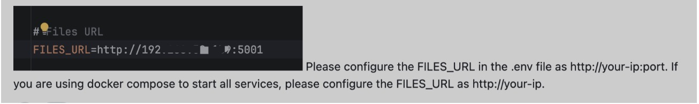

# MinerU Dify Plugin

## What's New in v0.0.2?

- Support the official API of MinerU
  

- Remove the "Replace Markdown Image Path" tool. Now, the image paths in the Markdown will be automatically replaced with previewable URLs (the validity period of the URL is determined by the FILES_ACCESS_TIMEOUT in dify.env).If you want to use this feature, please update the Dify's core code.

- Supports more export formats (HTML, DOC, LaTeX). The download links for the additional formats will be stored in the `files` of the output variables.
  
  

## GitHub

MinerU is a tool that converts PDFs into machine-readable formats (e.g., markdown, JSON), allowing for easy extraction into any format.

MinerU is a document parser that can parse complex document data for any downstream LLM use case (RAG, agents)

[GitHub - opendatalab/MinerU: A high-quality tool for convert PDF to Markdown and JSON.](https://github.com/opendatalab/MinerU)

## Key Features

- Remove headers, footers, footnotes, page numbers, etc., to ensure semantic coherence.
- Output text in human-readable order, suitable for single-column, multi-column, and complex layouts.
- Preserve the structure of the original document, including headings, paragraphs, lists, etc.
- Extract images, image descriptions, tables, table titles, and footnotes.
- Automatically recognize and convert formulas in the document to LaTeX format.
- Automatically recognize and convert tables in the document to HTML format.
- Automatically detect scanned PDFs and garbled PDFs and enable OCR functionality.
- OCR supports detection and recognition of 84 languages.
- Supports multiple output formats, such as multimodal and NLP Markdown, JSON sorted by reading order, and rich intermediate formats.
- Supports various visualization results, including layout visualization and span visualization, for efficient confirmation of output quality.
- Supports running in a pure CPU environment, and also supports GPU(CUDA)/NPU(CANN)/MPS acceleration
- Compatible with Windows, Linux, and Mac platforms.

## Getting Started

### 1. MinerU Officail API

The version 0.0.2 can now support the official API of MinerU.

1. Configure the base URL of the MinerU API service (e.g., https://mineru.net), and select "MinerU Official API" for the server type.

2. Configure the API token([Get your api token from MinerU](https://mineru.net/apiManage/token))

### Input Parameters

| parameter                  | type     | required | example         | description                                                                                                                                                                                                                                                                                                                                                                              |
|:--------------------------:| -------- | -------- | --------------- | ---------------------------------------------------------------------------------------------------------------------------------------------------------------------------------------------------------------------------------------------------------------------------------------------------------------------------------------------------------------------------------------- |
| enable formula recognition | bool     | false    | true            | Whether to enable formula recognition, the default is true                                                                                                                                                                                                                                                                                                                               |
| enable table recognition   | bool     | false    | true            | Whether to enable table recognition, the default is true                                                                                                                                                                                                                                                                                                                                 |
| layout model               | string   | false    | doclayout_yolo  | Optional value: doclayout_yolo, layoutlmv3, the default value is doclayout_yolo. doclayout_yolo is a self-developed model, the effect is better                                                                                                                                                                                                                                          |
| document language          | string   | false    | ch              | Specify the document language, the default ch, can be set to auto, when it is auto, the model will automatically recognize the document language, see the list of other optional values for details：[PaddleOCR ](https://paddlepaddle.github.io/PaddleOCR/latest/ppocr/blog/multi_languages.html#5) |
| enable ocr recognition     | bool     | false    | true            | Whether to start the ocr function, the default is false                                                                                                                                                                                                                                                                                                                                  |
| extra export formats       | [string] | false    | ["docx","html"] | Markdown and json are the default export formats without setting. This parameter only supports one or more of the three formats of docx, html, and latex.                                                                                                                                                                                                                                |

#### Output Variables

The plugin provides five types of output for each processed file:

> text : The parsed Markdown text
> 
> files:  The extra export formats files(html,docx,latex)
> 
> json: The parsed content list 
> 
> full_zip_url: Only for Official API, the zip URL of the complete parsed result
> 
> images: The images extracted from the PDF

### 2. Local Deploy

Version 0.0.2 of the plugin corresponds to MinerU release 1.2.2.

1. Deploy Derived Projects

[MinerU/projects/web_api/README.md at magic_pdf-1.2.2-released · opendatalab/MinerU · GitHub](https://github.com/opendatalab/MinerU/blob/magic_pdf-1.2.2-released/projects/web_api/README.md)

2. Configure the base URL of the locally deployed MinerU service (e.g., http://192.168.0.1:8888), and select "Local Deployment" for the server type.
   
   **Note:Ensure that the Dify service can access this base URL.**
   
   

#### Input Parameters

| Parameter    | Type   | Required | Default | Description                               |
| ------------ | ------ | -------- | ------- | ----------------------------------------- |
| file         | file   | Yes      | -       | File to be parsed                         |
| parse_method | select | Yes      | auto    | Parsing method, can be auto, ocr, or txt. |

**Note: Other parameters are invalid for the local deployment version. **

#### Output Variables

as above

## FAQs

1.

https://github.com/langgenius/dify/issues/16327

## Credits

This plugin is powered by [MinerU]([GitHub - opendatalab/MinerU: A high-quality tool for convert PDF to Markdown and JSON.一站式开源高质量数据提取工具，将PDF转换成Markdown和JSON格式。](https://github.com/opendatalab/MinerU))
