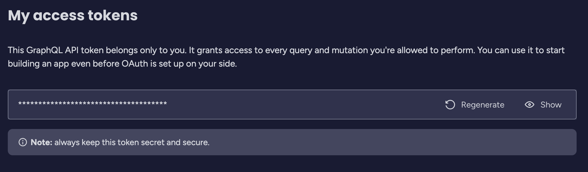
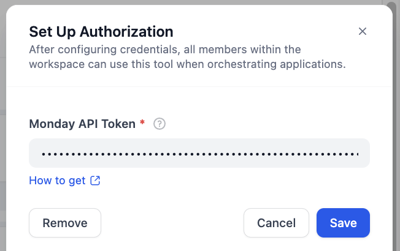
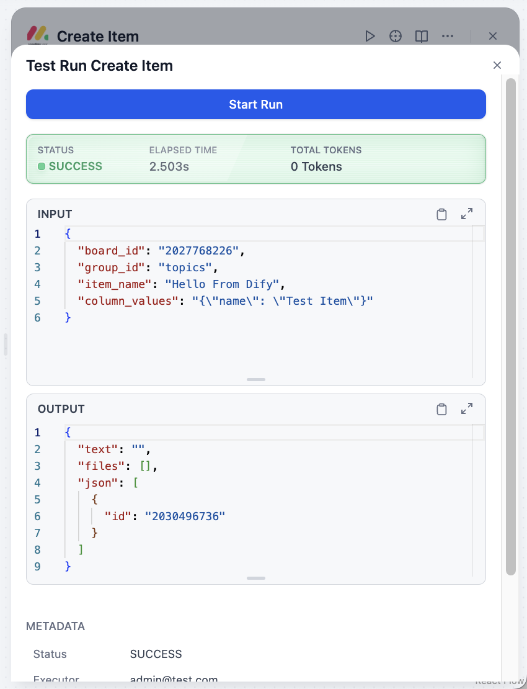
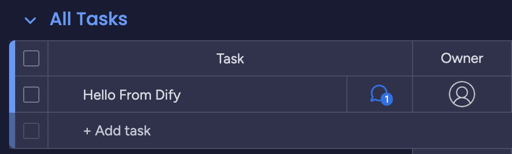

## dify-plugin-monday

**Author:** langgenius

**Version:** 0.0.1

**Type:** tool

### Description

This plugin integrates with the Monday.com platform and enables automated management of boards, groups, columns, items, their statuses, and updates via the Dify Agent tool. Users can query, create, update, and delete boards, columns, and items, change item statuses, and add updates, greatly improving team collaboration and task management automation.

### Tools

- get_a_board: Get a single board by ID
- get_boards: Retrieve a list of all boards
- create_board: Create a new board
- get_board_columns: Get all columns of a specified board
- create_column: Add a new column to a board
- get_board_items_by_name: Find items in a board by name
- create_item: Create a new item in a board
- delete_item: Delete a specified item
- create_update: Add an update to an item

### Usage

1. Get token from Monday.com
    - You can get your token from the Monday.com [developer section](https://dify-league.monday.com/apps/manage/tokens)

2. Set up the plugin in Dify
    - Go to the Dify platform and navigate to the plugin management section.
    - Add this plugin by providing your Monday.com token.

3. Enjoy the features
    - Use the provided tools to manage your Monday.com boards, items, and updates directly from Dify.

### Privacy Policy

Please refer to the [Privacy Policy](PRIVACY.md) for details on data collection, processing, and user rights.

last updated: 2025-06-18
