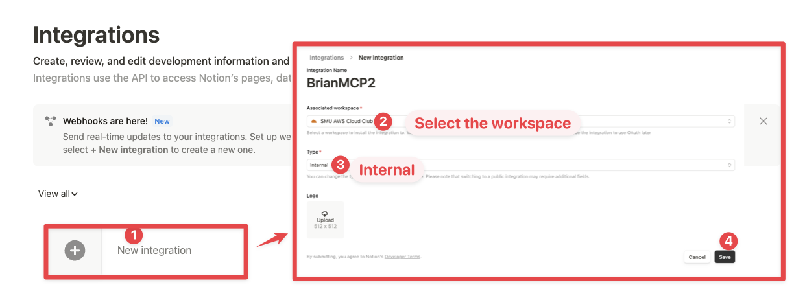
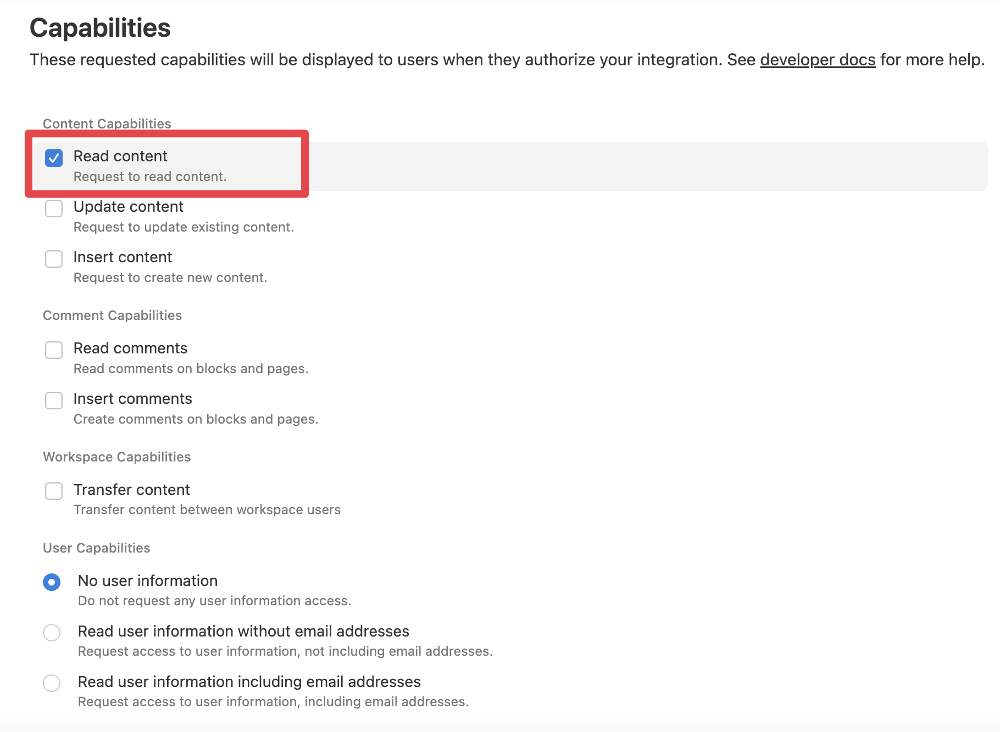
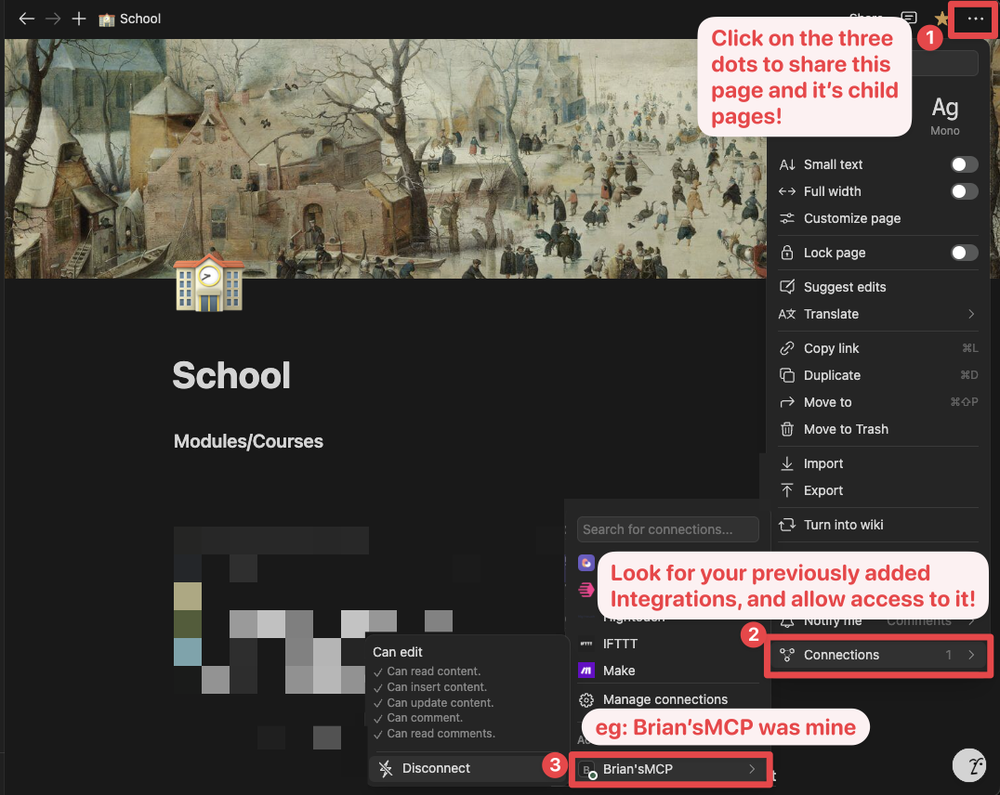

# Notion Plugin for Dify

## Overview

The Notion Plugin for Dify provides integration with Notion workspaces, allowing you to search, query databases, create and update pages directly from your Dify applications. It enables seamless interaction with your Notion content without leaving your Dify environment.

## Features

- **Search Notion**: Search for pages and databases in your Notion workspace by keywords
- **Query Database**: Retrieve and filter content from specific Notion databases
- **Create Page**: Create new pages in your Notion workspace with custom title and content
- **Retrieve Page**: Get a specific page and its content by ID
- **Update Page**: Update an existing page's title or add new content
- **Retrieve Database**: Get database structure and schema information
- **Create Database**: Create a new database with custom properties and schema
- **Update Database**: Modify an existing database's title or properties
- **Retrieve Comments**: Get comments from a specific page or block
- **Create Comment**: Add a new comment to a Notion page

## Configuration

### 1. Setting up Integration in Notion

Go to [Notion Integrations](https://www.notion.so/my-integrations) and create a new **internal** integration or select an existing one.



Give your integration an appropriate name and select the workspace you want to connect it to.

For security reasons, you may want to limit the capabilities of your integration. For example, you can create a read-only integration by only enabling "Read content" permission:



Copy your "Internal Integration Secret" from the "Secrets" tab. You'll need this to configure the plugin in Dify.

**Important:** Keep this secret secure. Anyone with this token can access content shared with your integration.

### 2. Connecting Content to Your Integration

For your integration to access specific pages or databases, you must explicitly share them with your integration:

1. Navigate to the page or database you want to access through the plugin
2. Click the "•••" (three dots) menu in the top-right corner
3. Select "Add connections" and choose your integration from the list



Repeat this process for each page or database you want to access with the plugin.

### 3. Configuring the Plugin in Dify

1. In your Dify workspace, navigate to the Plugins section
2. Find and select the Notion plugin
3. Paste your Integration Secret in the configuration field
4. Save your configuration

## Usage Examples

### Search Notion
```
Find pages in my Notion workspace containing "project plan"
```

### Query a Database
```
Show me all items in my Notion database with ID "abc123" where Status is "In Progress"
```

### Create a Page
```
Create a new Notion page titled "Meeting Notes" with content "Discussed project timeline and assigned tasks."
```

### Retrieve a Page
```
Get the Notion page with ID "abc123" and include its content
```

### Update a Page
```
Update the title of Notion page "abc123" to "Updated Meeting Notes" and add "Follow-up scheduled for next week" to the content
```

### Retrieve Database Structure
```
Get the structure and properties of Notion database "abc123"
```

### Create Database
```
Create a new database in Notion page "abc123" titled "Project Tasks" with properties for Name (title), Status (select), and Due Date (date)
```

### Update Database
```
Update the Notion database "abc123" to rename the "Status" property to "Progress"
```

### Retrieve Comments
```
Get all comments from the Notion page "abc123"
```

### Create Comment
```
Add a comment "Great progress on this task!" to Notion page "abc123"
```

## Supported Operations

1. **Search**: Find pages and databases across your workspace
2. **Query Database**: Retrieve and filter records from a specific database
3. **Create Page**: Create new pages with title and content
4. **Retrieve Page**: Get page details including properties and content blocks
5. **Update Page**: Modify page titles or append new content 
6. **Retrieve Database**: Get database structure, schema and property types
7. **Create Database**: Create new databases with custom properties
8. **Update Database**: Update database title or modify properties
9. **Retrieve Comments**: Get comments from a page or block
10. **Create Comment**: Add comments to a page
11. **Extract Data**: Process various Notion property types including rich text, select, multi-select, etc.

## Troubleshooting

- **Authentication Errors**: Make sure your integration token is valid and not expired
- **Access Errors**: Ensure the integration has been given access to the pages/databases you're trying to work with
- **Not Found Errors**: Check that the database or page IDs are correct and accessible
- **Rate Limiting**: If you receive rate limit errors, the plugin will automatically retry with backoff
