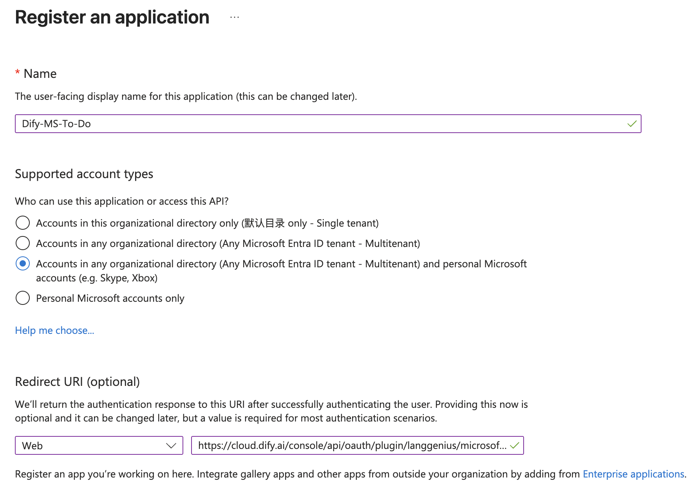
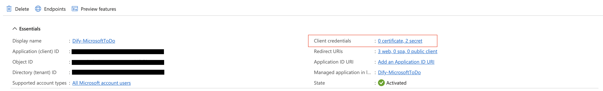
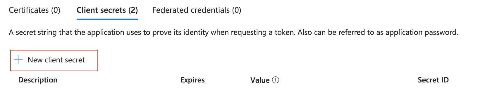
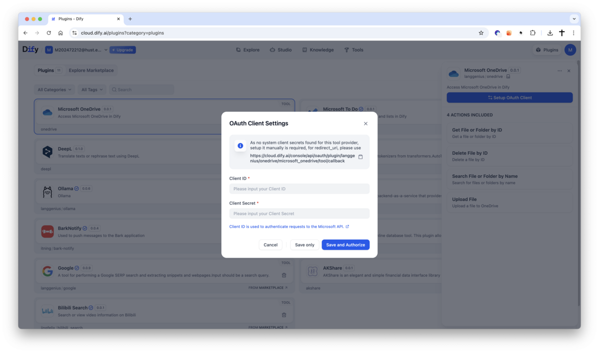

# Microsoft OneDrive Plugin

**Author**: langgenius
**Version**: 0.0.1
**Type**: plugin

## Introduction

This plugin integrates with Microsoft OneDrive, enabling you to search, retrieve, upload, and delete files or folders directly from Dify. It allows automated file management and access to your OneDrive storage through Dify workflows.

## Setup

1. Register your application in the [Microsoft Azure Portal](https://portal.azure.com/#view/Microsoft_AAD_RegisteredApps/ApplicationsListBlade).

<p align="center">
    
</p>

2. Create a new application as follows:
    - **Name**: Dify OneDrive Plugin
    - **Supported account types**: select
        ```
        Accounts in any organizational directory (Any Microsoft Entra ID tenant - Multitenant) and personal Microsoft accounts (e.g. Skype, Xbox)
        ```
    - **Redirect URI**: Choose `Web` and set the URI to:
        - For SaaS (cloud.dify.ai) users: please use
        ```
        https://cloud.dify.ai/console/api/oauth/plugin/langgenius/onedrive/microsoft_onedrive/tool/callback
        ```
        - For self-hosted users: please use
        ```
        http://<YOUR LOCALHOST CONSOLE_API_URL>/console/api/oauth/plugin/langgenius/onedrive/microsoft_onedrive/tool/callback
        ```
        - ***Due to the restrictions of the Microsoft OAuth2 flow, redirect URIs must start with `https://` or `http://localhost`.***
        - Enable "Access tokens" and "ID tokens" under "Implicit grant and hybrid flows"

<p align="center">
        
</p>

3. Copy your **Application (client) ID**

<p align="center">
    
</p>

4. Create a new client secret:
    - **Description**: Dify OneDrive Plugin Secret
    - **Expires**: Whatever duration you prefer (e.g., 1 year, 2 years, etc.)
    - Copy the generated **Value** of the client secret.

<p align="center">
    
</p>

5. Configure the plugin in Dify:
    - Fill in the **Client ID** and **Client Secret** fields with the values you copied from the Azure Portal.
    - Make sure you have the same redirect URI as specified in the Azure Portal. If not, you will need to update it in the Azure Portal.
    - Click `Save and authorize` to initiate the OAuth flow.

6. Enjoy using the Microsoft OneDrive plugin in Dify!

<p align="center">
    
    
</p>


## Tool Descriptions

### get_file_by_id
Retrieve a file or folder from OneDrive by its ID. For folders, `download` will not return as file.

**Parameters:**
- file_id (string): The ID of the file or folder to retrieve.
- download (boolean, optional): Whether to download the file or not.

### delete_file_by_id
Delete a file from OneDrive by its ID.

**Parameters:**
- file_id (string): The ID of the file to delete.

### search_file
Search for files or folders in OneDrive by name.

**Parameters:**
- query (string): The name of the file or folder to search for.
- limit (number, optional): The maximum number of results to return (default: 10).

### upload_file
Upload a file to OneDrive root directory.

**Parameters:**
- file (file): The file to upload to OneDrive.
- file_name (string, optional): Custom name for the uploaded file. If not provided, the original file name is used.


## PRIVACY

Please refer to the [Privacy Policy](PRIVACY.md) for information on how your data is handled when using this plugin.

Last updated: July 31, 2025
