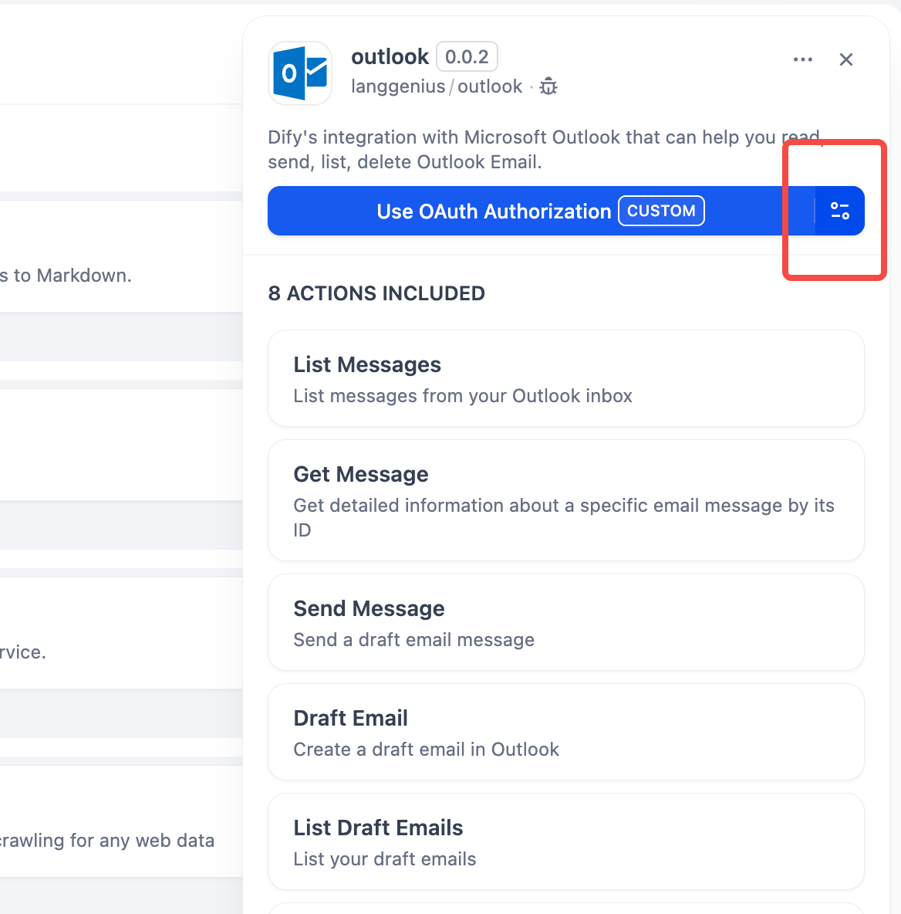
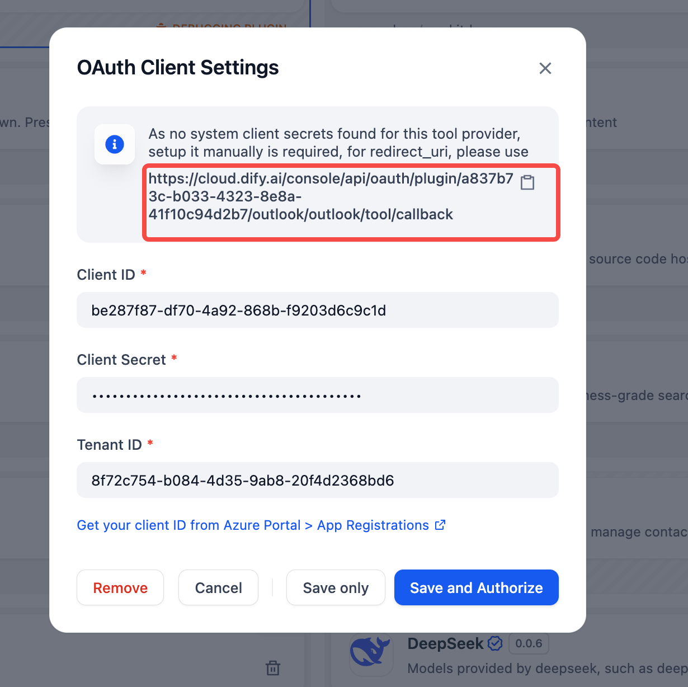
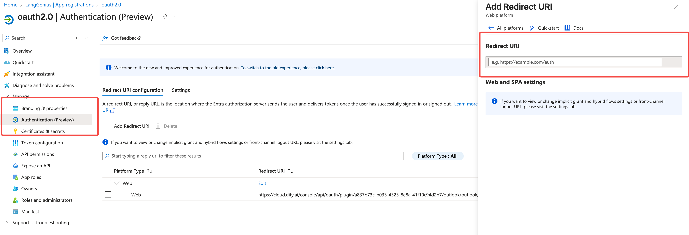

# Outlook Plugin for Dify

**Author:** langgenius
**Version:** 0.0.3
**Type:** Plugin

---

## English Version

### Description
This plugin uses OAuth 2.0 authorization code flow for secure authentication with Microsoft Outlook. Users authenticate directly with their Microsoft account, providing secure access to their Outlook emails without sharing application credentials.

### Features
- List messages from your Outlook inbox or other folders
- Get detailed information about specific messages
- Send new email messages (via draft and send flow)
- Create draft emails
- List draft emails
- Add attachments to draft emails
- Set the priority/importance of an email
- Flag emails for follow-up
- Search and filter messages

### Available Tools
| Tool Name                | Description |
|------------------------- |-------------|
| list_messages            | List messages from your Outlook inbox or other folders. Supports filtering, search, and pagination. |
| get_message              | Get detailed information about a specific email message, including content, attachments, and metadata. |
| draft_email              | Create a draft email in Outlook. Supports to/cc/bcc, subject, body (text or HTML), and importance. |
| list_draft_emails        | List your draft emails. Supports filtering, search, and attachment info. |
| send_message             | Send a draft email message. Requires a draft ID from the draft_email tool. |
| add_attachment_to_draft  | Add a file attachment to an existing draft email. |
| prioritize_email         | Set the priority level (low, normal, high) of an email message. |
| flag_email               | Flag an email message for follow-up, with optional due date and message. |

### Installation

#### Step 1: Create an Azure AD Application
1. Go to Azure Portal > App Registrations
2. Create a new registration
   
3. Add Microsoft Graph API permissions:
   - Mail.Read
   - Mail.Send
   - Mail.ReadWrite
   
4. Create a client secret
   
5. Note down the client ID, client secret, and tenant ID
   

#### Step 2: Install the Plugin in Dify
1. Go to your Dify workspace
2. Navigate to Tools > Plugins
3. Click "Add Plugin"
4. Select this Outlook plugin
5. **IMPORTANT: Click the config button besides "Use OAuth Authorization" config button first**
   
6. After OAuth setup, enter your Azure AD credentials:
   - Client ID
   - Client Secret
   - Tenant ID

7. Copy the redirect URI from the OAuth Client Settings dialog:
   - Look for the redirect URI with a copy icon in the dialog
   - Click the copy icon to copy the exact URL
   - Use this URL when configuring your Azure AD app registration's redirect URI
   

#### Step 3: Configure OAuth Settings
1. In your Azure AD app registration, go to "Authentication"
2. Select "Web" as the platform type
3. Add the redirect URI we just copied
4. Enable "Access tokens" and "ID tokens" under "Implicit grant and hybrid flows"


### OAuth Authorization Flow

#### Before Entering Credentials:
1. **Click "Use OAuth Authorization"** - This sets up the OAuth flow
2. **Complete the Microsoft login** - You'll be redirected to Microsoft to authenticate
3. **Grant permissions** - Allow the app to access your Outlook emails
4. **Return to Dify** - You'll be redirected back with an access token

#### After OAuth Setup:
1. Enter your Azure AD application credentials (Client ID, Client Secret, Tenant ID)
2. The plugin will use the OAuth access token for all API calls
3. No need to manage user credentials - authentication is handled securely through Microsoft

### Usage Examples

#### List Messages
```
List the last 10 messages from my inbox
```

#### Search Messages
```
Find emails from john@example.com in my inbox
```

#### Read Message
```
Get the details of message with ID abc123
```

#### Create Draft
```
Create a draft email to jane@example.com with subject "Hello" and body "Hi Jane!"
```

#### List Drafts
```
List my draft emails
```

#### Add Attachment to Draft
```
Add file report.pdf to draft with ID draft123
```

#### Send Message
```
Send the draft with ID draft123
```

#### Set Priority
```
Set the priority of message with ID abc123 to high
```

#### Flag Message
```
Flag message with ID abc123 for follow-up in 2 days with message "Review required"
```

### Configuration
The plugin requires the following Microsoft Graph API permissions:
- Mail.Read: For reading emails
- Mail.Send: For sending emails
- Mail.ReadWrite: For updating email properties (flags, priority)

### Security Benefits
- **No shared credentials**: Users authenticate directly with Microsoft
- **Secure token management**: Access tokens are handled securely by Dify
- **User-specific access**: Each user accesses only their own emails
- **Automatic token refresh**: OAuth handles token expiration automatically

### Troubleshooting

#### OAuth Issues:
1. **"Use OAuth Authorization" not working:**
   - Ensure your Azure AD app has the correct redirect URI
   - Check that OAuth is properly configured in Azure AD

2. **Authentication fails:**
   - Verify your Azure AD credentials are correct
   - Check if your application has the required permissions
   - Ensure your client secret hasn't expired

3. **API Errors:**
   - Check your internet connection
   - Verify your Outlook account is accessible
   - Ensure you have the necessary permissions

#### Common Error Messages:
- **"Id is malformed"**: The tool now handles URL encoding automatically
- **"SearchWithOrderBy"**: Search and orderby parameters are now handled correctly
- **"Access denied"**: Check that OAuth permissions are granted

---

## 日本語版 (Japanese Version)

### 説明
このプラグインは、Microsoft Outlookとの安全な認証のためにOAuth 2.0認証コードフローを使用します。ユーザーはMicrosoftアカウントで直接認証し、アプリケーション認証情報を共有することなくOutlookメールに安全にアクセスできます。

### 機能
- Outlookの受信トレイやその他のフォルダーからメッセージを一覧表示
- 特定のメッセージの詳細情報を取得
- 新しいメールメッセージを送信（ドラフトと送信フロー経由）
- ドラフトメールを作成
- ドラフトメールを一覧表示
- ドラフトメールに添付ファイルを追加
- メールの優先度/重要度を設定
- フォローアップ用にメールにフラグを設定
- メッセージの検索とフィルタリング

### 利用可能なツール
| ツール名                | 説明 |
|------------------------- |-------------|
| list_messages            | Outlookの受信トレイやその他のフォルダーからメッセージを一覧表示。フィルタリング、検索、ページネーションをサポート。 |
| get_message              | 特定のメールメッセージの詳細情報を取得。コンテンツ、添付ファイル、メタデータを含む。 |
| draft_email              | Outlookでドラフトメールを作成。to/cc/bcc、件名、本文（テキストまたはHTML）、重要度をサポート。 |
| list_draft_emails        | ドラフトメールを一覧表示。フィルタリング、検索、添付ファイル情報をサポート。 |
| send_message             | ドラフトメールメッセージを送信。draft_emailツールからのドラフトIDが必要。 |
| add_attachment_to_draft  | 既存のドラフトメールにファイル添付を追加。 |
| prioritize_email         | メールメッセージの優先度レベル（低、通常、高）を設定。 |
| flag_email               | フォローアップ用にメールメッセージにフラグを設定。オプションで期限とメッセージを設定可能。 |

### インストール

#### ステップ1: Azure ADアプリケーションを作成
1. Azure Portal > アプリの登録に移動
2. 新しい登録を作成
   
3. Microsoft Graph APIのアクセス許可を追加：
   - Mail.Read
   - Mail.Send
   - Mail.ReadWrite
   
4. クライアントシークレットを作成
   
5. クライアントID、クライアントシークレット、テナントIDを記録
   

#### ステップ2: Difyにプラグインをインストール
1. Difyワークスペースに移動
2. ツール > プラグインに移動
3. 「プラグインを追加」をクリック
4. このOutlookプラグインを選択
5. **重要：「Use OAuth Authorization」設定ボタンの横の設定ボタンを最初にクリックしてください**
   
6. OAuth設定後、Azure AD認証情報を入力：
   - クライアントID
   - クライアントシークレット
   - テナントID

7. OAuthクライアント設定ダイアログからリダイレクトURIをコピー：
   - ダイアログ内のコピーアイコンのあるリダイレクトURIを探す
   - コピーアイコンをクリックして正確なURLをコピー
   - このURLをAzure ADアプリ登録のリダイレクトURI設定で使用
   

#### ステップ3: OAuth設定を構成
1. Azure ADアプリ登録で「認証」に移動
2. プラットフォームタイプとして「Web」を選択
3. コピーしたリダイレクトURIを追加
4. 「暗黙的許可とハイブリッドフロー」で「アクセストークン」と「IDトークン」を有効化


### OAuth認証フロー

#### 認証情報を入力する前：
1. **「Use OAuth Authorization」をクリック** - OAuthフローを設定
2. **Microsoftログインを完了** - Microsoftにリダイレクトされて認証
3. **権限を許可** - アプリがOutlookメールにアクセスすることを許可
4. **Difyに戻る** - アクセストークンと共にリダイレクトされる

#### OAuth設定後：
1. 输入您的Azure AD应用程序凭据（客户端ID、客户端密钥、租户ID）
2. 插件将使用OAuth访问令牌进行所有API调用
3. 无需管理用户凭据 - 认证通过Microsoft安全处理

### 使用例

#### メッセージを一覧表示
```
受信トレイから最新の10件のメッセージを一覧表示
```

#### メッセージを検索
```
受信トレイからjohn@example.comからのメールを検索
```

#### メッセージを読む
```
ID abc123のメッセージの詳細を取得
```

#### ドラフトを作成
```
jane@example.comに件名「Hello」、本文「Hi Jane!」でドラフトメールを作成
```

#### ドラフトを一覧表示
```
ドラフトメールを一覧表示
```

#### ドラフトに添付ファイルを追加
```
ID draft123のドラフトにファイルreport.pdfを添付
```

#### メッセージを送信
```
ID draft123のドラフトを送信
```

#### 優先度を設定
```
将ID为abc123的消息的优先级设置为高
```

#### 为消息设置标志
```
为ID为abc123的消息设置2天后跟进的标志，消息为"需要审查"
```

### 設定
插件需要以下Microsoft Graph API权限：
- Mail.Read：用于读取邮件
- Mail.Send：用于发送邮件
- Mail.ReadWrite：用于更新邮件属性（标志、优先级）

### セキュリティの利点
- **无共享凭据**：用户直接通过Microsoft认证
- **安全令牌管理**：访问令牌由Dify安全处理
- **用户特定访问**：每个用户只能访问自己的邮件
- **自动令牌刷新**：OAuth自动处理令牌过期

### トラブルシューティング

#### OAuth问题：
1. **"Use OAuth Authorization"不工作：**
   - 确保Azure AD应用程序有正确的重定向URI
   - 检查Azure AD中OAuth配置是否正确

2. **认证失败：**
   - 验证Azure AD凭据是否正确
   - 检查应用程序是否有所需权限
   - 确保客户端密钥未过期

3. **API错误：**
   - 检查互联网连接
   - 验证Outlook账户是否可访问
   - 确保有必要的权限

#### 常见错误消息：
- **"Id is malformed"**：工具现在自动处理URL编码
- **"SearchWithOrderBy"**：搜索和orderby参数现在正确处理
- **"Access denied"**：检查OAuth权限是否已授予

---

## 中文版 (Chinese Version)

### 描述
此插件使用OAuth 2.0授权代码流程与Microsoft Outlook进行安全认证。用户直接通过Microsoft账户进行认证，无需共享应用程序凭据即可安全访问Outlook邮件。

### 功能
- 列出Outlook收件箱或其他文件夹中的消息
- 获取特定消息的详细信息
- 发送新邮件消息（通过草稿和发送流程）
- 创建草稿邮件
- 列出草稿邮件
- 向草稿邮件添加附件
- 设置邮件的优先级/重要性
- 为邮件设置跟进标志
- 搜索和过滤消息

### 可用工具
| 工具名称                | 描述 |
|------------------------- |-------------|
| list_messages            | 列出Outlook收件箱或其他文件夹中的消息。支持过滤、搜索和分页。 |
| get_message              | 获取特定邮件消息的详细信息，包括内容、附件和元数据。 |
| draft_email              | 在Outlook中创建草稿邮件。支持收件人/抄送/密送、主题、正文（文本或HTML）和重要性。 |
| list_draft_emails        | 列出您的草稿邮件。支持过滤、搜索和附件信息。 |
| send_message             | 发送草稿邮件消息。需要来自draft_email工具的草稿ID。 |
| add_attachment_to_draft  | 向现有草稿邮件添加文件附件。 |
| prioritize_email         | 设置邮件消息的优先级级别（低、正常、高）。 |
| flag_email               | 为邮件消息设置跟进标志，可选择到期日期和消息。 |

### 安装

#### 步骤1：创建Azure AD应用程序
1. 转到Azure Portal > 应用程序注册
2. 创建新注册
   
3. 添加Microsoft Graph API权限：
   - Mail.Read
   - Mail.Send
   - Mail.ReadWrite
   
4. 创建客户端密钥
   
5. 记录客户端ID、客户端密钥和租户ID
   

#### 步骤2：在Dify中安装插件
1. 转到您的Dify工作区
2. 导航到工具 > 插件
3. 点击"添加插件"
4. 选择此Outlook插件
5. **重要：首先点击"Use OAuth Authorization"配置按钮旁边的配置按钮**
   
6. OAuth设置后，输入您的Azure AD凭据：
   - 客户端ID
   - 客户端密钥
   - 租户ID

7. 从OAuth客户端设置对话框复制重定向URI：
   - 在对话框中查找带有复制图标的重定向URI
   - 点击复制图标复制确切的URL
   - 在配置Azure AD应用程序注册的重定向URI时使用此URL
   

#### 步骤3：配置OAuth设置
1. 在Azure AD应用程序注册中，转到"身份验证"
2. 选择"Web"作为平台类型
3. 添加我们刚才复制的重定向URI
4. 在"隐式授权和混合流"下启用"访问令牌"和"ID令牌"


### OAuth授权流程

#### 输入凭据之前：
1. **点击"Use OAuth Authorization"** - 设置OAuth流程
2. **完成Microsoft登录** - 您将被重定向到Microsoft进行认证
3. **授予权限** - 允许应用程序访问您的Outlook邮件
4. **返回Dify** - 您将带着访问令牌重定向回来

#### OAuth设置后：
1. 输入您的Azure AD应用程序凭据（客户端ID、客户端密钥、租户ID）
2. 插件将使用OAuth访问令牌进行所有API调用
3. 无需管理用户凭据 - 认证通过Microsoft安全处理

### 使用示例

#### 列出消息
```
列出收件箱中最近的10条消息
```

#### 搜索消息
```
在收件箱中查找来自john@example.com的邮件
```

#### 读取消息
```
获取ID为abc123的消息的详细信息
```

#### 创建草稿
```
向jane@example.com创建主题为"Hello"、正文为"Hi Jane!"的草稿邮件
```

#### 列出草稿
```
列出我的草稿邮件
```

#### 向草稿添加附件
```
向ID为draft123的草稿添加文件report.pdf
```

#### 发送消息
```
发送ID为draft123的草稿
```

#### 设置优先级
```
将ID为abc123的消息的优先级设置为高
```

#### 为消息设置标志
```
为ID为abc123的消息设置2天后跟进的标志，消息为"需要审查"
```

### 配置
插件需要以下Microsoft Graph API权限：
- Mail.Read：用于读取邮件
- Mail.Send：用于发送邮件
- Mail.ReadWrite：用于更新邮件属性（标志、优先级）

### 安全优势
- **无共享凭据**：用户直接通过Microsoft认证
- **安全令牌管理**：访问令牌由Dify安全处理
- **用户特定访问**：每个用户只能访问自己的邮件
- **自动令牌刷新**：OAuth自动处理令牌过期

### 故障排除

#### OAuth问题：
1. **"Use OAuth Authorization"不工作：**
   - 确保Azure AD应用程序有正确的重定向URI
   - 检查Azure AD中OAuth配置是否正确

2. **认证失败：**
   - 验证Azure AD凭据是否正确
   - 检查应用程序是否有所需权限
   - 确保客户端密钥未过期

3. **API错误：**
   - 检查互联网连接
   - 验证Outlook账户是否可访问
   - 确保有必要的权限

#### 常见错误消息：
- **"Id is malformed"**：工具现在自动处理URL编码
- **"SearchWithOrderBy"**：搜索和orderby参数现在正确处理
- **"Access denied"**：检查OAuth权限是否已授予

---


