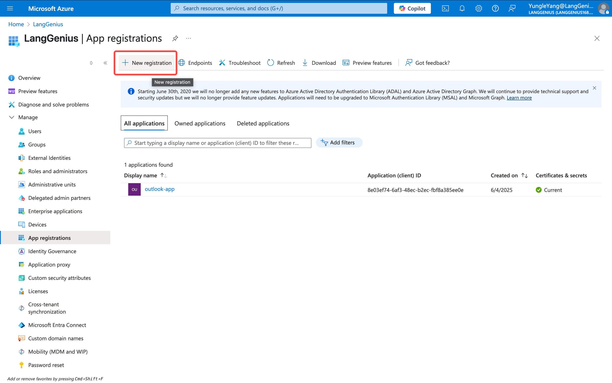
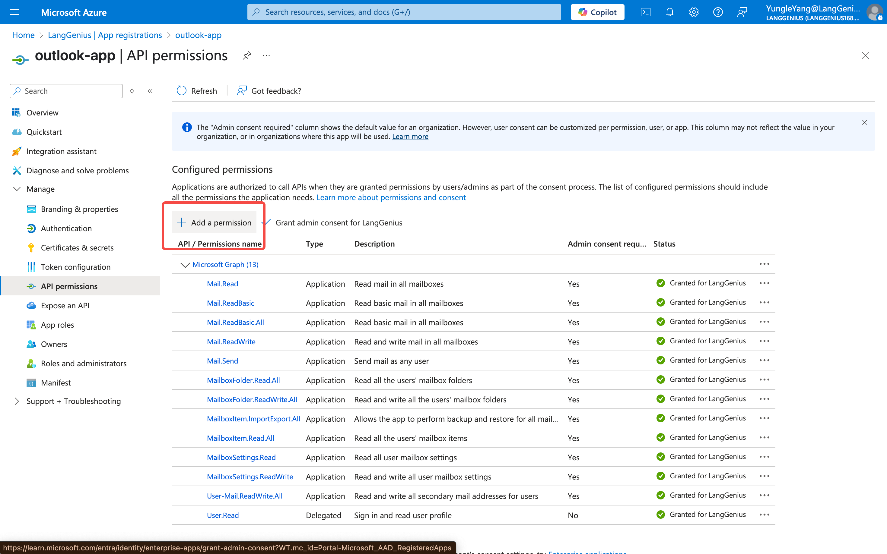
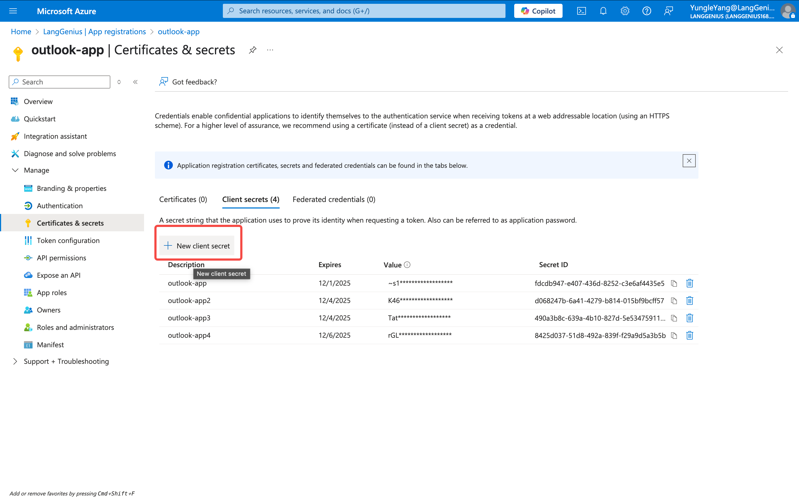
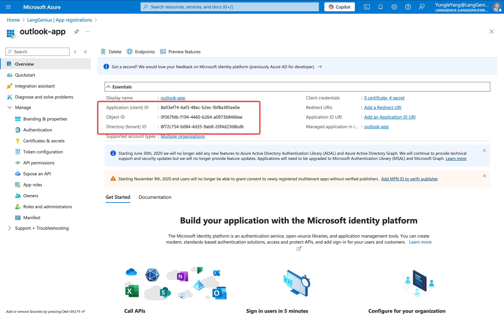

# Outlook Plugin for Dify

**Author:** langgenius
**Version:** 0.0.1
**Type:** Plugin

## Description
This plugin uses the client credentials flow (not the standard OAuth 2.0 authorization code flow). The plugin authenticates using the application's credentials (client ID and client secret), rather than individual user logins. **Security note:** Using the client credentials flow can have security implications. The application will have broad access to mailbox data as configured in Azure AD, and anyone with access to the client secret can potentially access your Outlook data. Keep your credentials secure and restrict access appropriately.

## Features
- List messages from your Outlook inbox or other folders
- Get detailed information about specific messages
- Send new email messages (via draft and send flow)
- Create draft emails
- List draft emails
- Add attachments to draft emails
- Set the priority/importance of an email
- Flag emails for follow-up
- Search and filter messages

## Available Tools
| Tool Name                | Description |
|------------------------- |-------------|
| list_messages            | List messages from your Outlook inbox or other folders. Supports filtering, search, and pagination. |
| get_message              | Get detailed information about a specific email message, including content, attachments, and metadata. |
| draft_email              | Create a draft email in Outlook. Supports to/cc/bcc, subject, body (text or HTML), and importance. |
| list_draft_emails        | List your draft emails. Supports filtering, search, and attachment info. |
| send_message             | Send a draft email message. Requires a draft ID from the draft_email tool. |
| add_attachment_to_draft  | Add a file attachment to an existing draft email. |
| prioritize_email         | Set the priority level (low, normal, high) of an email message. |
| flag_email               | Flag an email message for follow-up, with optional due date and message. |

## Installation
1. Create an Azure AD application:
   - Go to Azure Portal > App Registrations
   - Create a new registration
   
   - Add Microsoft Graph API permissions:
     - Mail.Read
     - Mail.Send
   
   - Create a client secret
   
   - Note down the client ID, client secret, and tenant ID
   

2. Install the plugin in Dify:
   - Go to your Dify workspace
   - Navigate to Tools > Plugins
   - Click "Add Plugin"
   - Select this Outlook plugin
   - Enter your Azure AD credentials:
     - Client ID
     - Client Secret
     - Tenant ID

## Usage Examples

### List Messages
```
List the last 10 messages from my inbox
```

### Search Messages
```
Find emails from john@example.com in my inbox
```

### Read Message
```
Get the details of message with ID abc123
```

### Create Draft
```
Create a draft email to jane@example.com with subject "Hello" and body "Hi Jane!"
```

### List Drafts
```
List my draft emails
```

### Add Attachment to Draft
```
Add file report.pdf to draft with ID draft123
```

### Send Message
```
Send the draft with ID draft123
```

### Set Priority
```
Set the priority of message with ID abc123 to high
```

### Flag Message
```
Flag message with ID abc123 for follow-up in 2 days with message "Review required"
```

## Configuration
The plugin requires the following Azure AD application permissions:
- Mail.Read: For reading emails
- Mail.Send: For sending emails

## Troubleshooting
1. Authentication Issues:
   - Verify your Azure AD credentials
   - Check if your application has the required permissions
   - Ensure your client secret hasn't expired

2. API Errors:
   - Check your internet connection
   - Verify your Outlook account is accessible
   - Ensure you have the necessary permissions

## Contributing
Contributions are welcome! Please feel free to submit a Pull Request.

## License
This project is licensed under the MIT License - see the LICENSE file for details.


