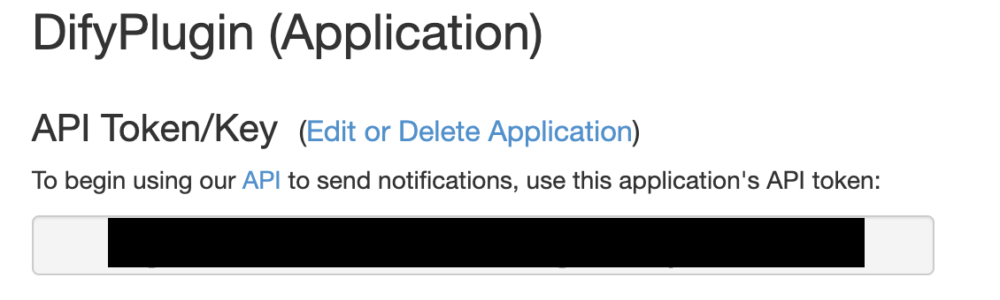
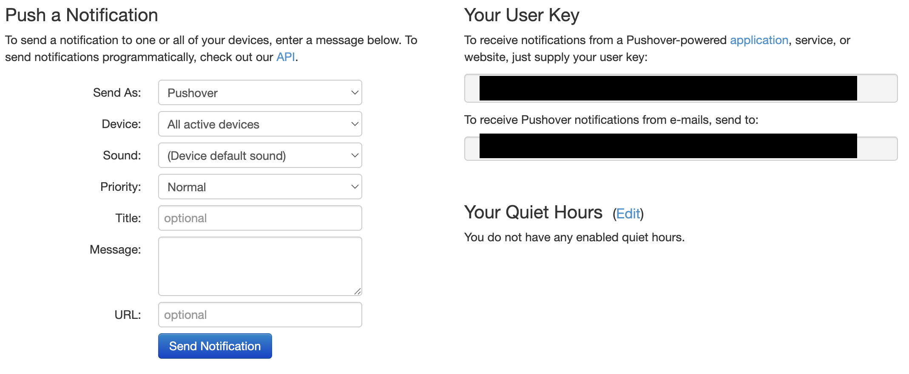
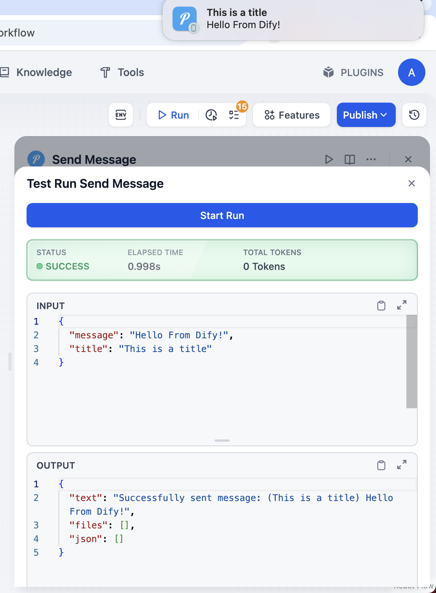

# Pushover Dify Plugin

**Author:** langgenius

**Version:** 0.0.1

**Type:** plugin

## Description
Pushover Dify Plugin is a plugin for the Dify platform that allows users to send push notifications to devices via the Pushover service and retrieve the list of registered devices. This plugin is suitable for scenarios requiring automated notifications and message pushing.

## Tools

- get_devices: Retrieves the list of devices registered with the Pushover service (your app).

- send_message: Sends a message to a specified device or all devices using the Pushover service.

## Usage

- Create a Pushover app at https://pushover.net/apps/build and obtain your API token.

- Retrieve your User Key from the Pushover dashboard at https://pushover.net/

- Fill in the `api_token` and `user_key` fields in the plugin configuration.

- Now you can use the `get_devices` and `send_message` tools in your Dify workflows.

## PRIVACY

check the [privacy policy](PRIVACY.md) for more information on how your data is handled.

last updated: 2025-06-05
