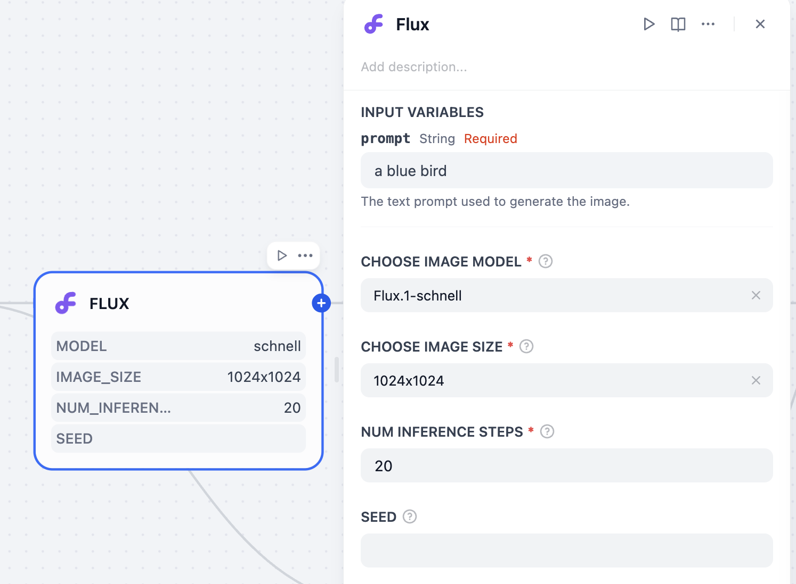
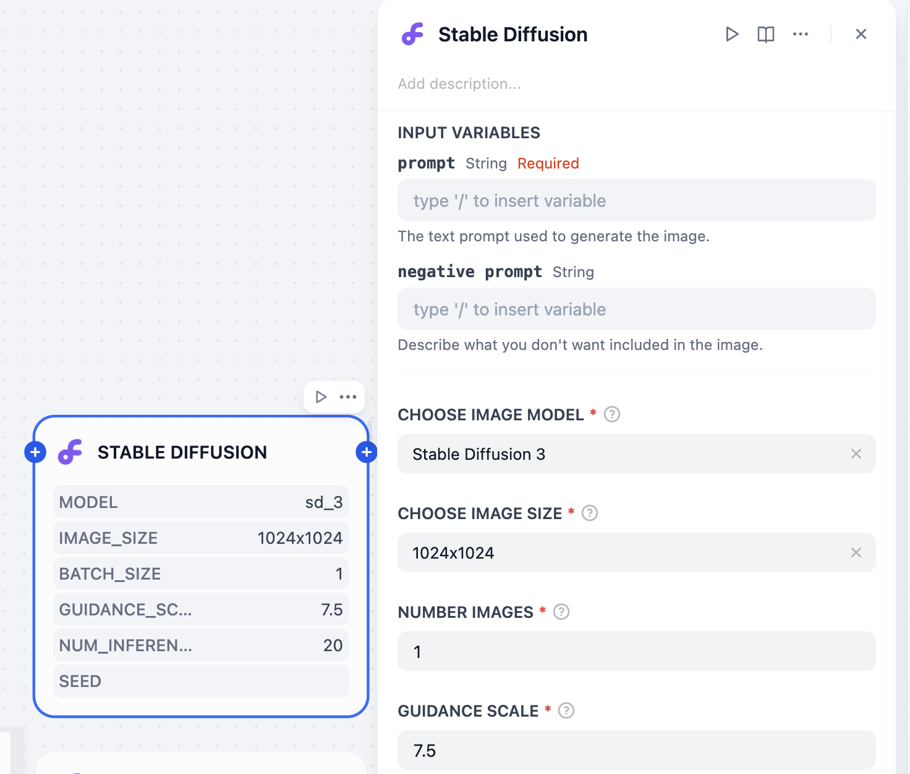
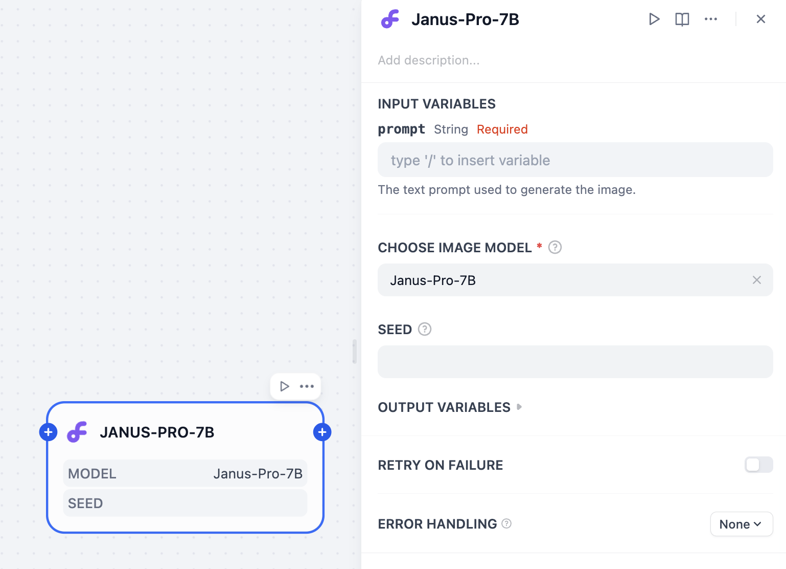
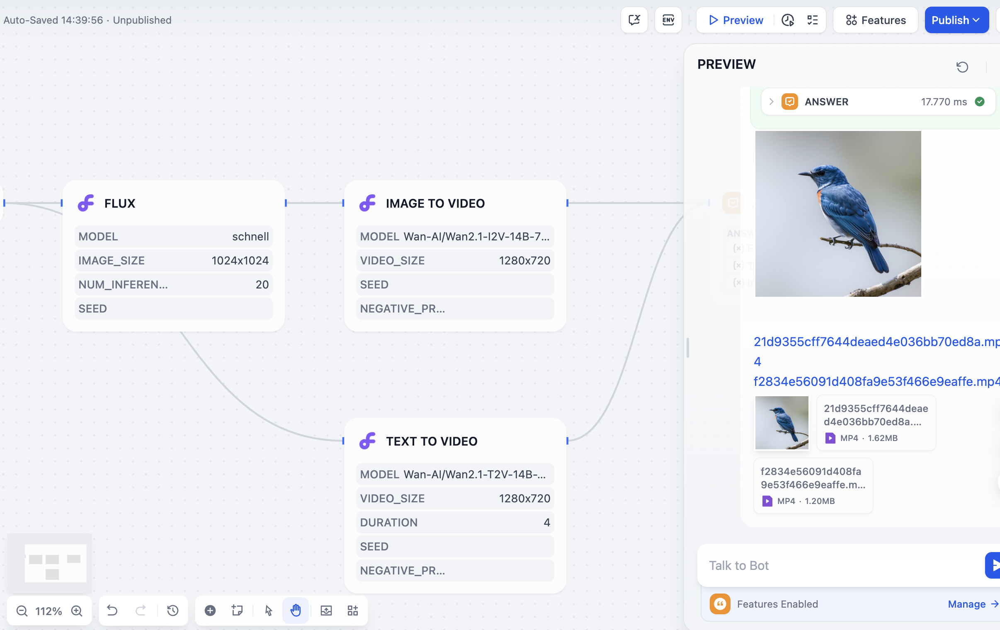

# SiliconFlow

## Overview

SiliconFlow provides high-quality GenAI services based on excellent open-source foundation models. You can use SiliconFlow in Dify to call image generation models like Flux and Stable Diffusion, and build your own AI image generation application.

## Configuration

### 1. Apply for SiliconCloud API Key

Create a new API Key on the [SiliconCloud API management](https://cloud.siliconflow.cn/account/ak) page and ensure that you have sufficient balance.

### 2. Get SiliconFlow tools from Plugin Marketplace

The SiliconFlow tools could be found at the Plugin Marketplace, please install it first.

### 3. Fill in the configuration in Dify

On the Dify navigation page, click `Tools > SiliconFlow > To Authorize` and fill in the API Key.

### 4. Using the tool

You can use the SiliconFlow tool in the following application types:

#### Chatflow / Workflow applications

Both Chatflow and Workflow applications support the SiliconFlow tool node. After adding it, you need to fill in the "Input Variables → Prompt" in the node with variables to reference the user's input prompt or the content generated by the previous node. Finally, use the variable to reference the image output by SiliconFlow in the "End" node.

#### Agent applications

Add the SiliconFlow tool in the Agent application, then send a picture description in the dialog box to call the tool to generate an AI image.

### 5. Features

#### Image Generation

**Flux**

A high-performance text-to-image generation model providing high-quality image outputs with customizable parameters.

- **Parameters**:
  - `prompt` (required): Text prompt used to generate the image
  - `model`: Choose between Flux.1-schnell or Flux.1-dev
  - `image_size`: Multiple resolution options (1024x1024, 768x1024, 576x1024, etc.)
  - `num_inference_steps`: 1-100 (default: 20) - more steps produce higher quality but take longer
  - `seed`: Optional parameter for reproducible results

**Stable Diffusion**

A versatile text-to-image diffusion model with advanced control parameters for fine-tuned image generation.

- **Parameters**:
  - `prompt` (required): Text prompt used to generate the image
  - `negative_prompt`: Describe what you don't want included in the image
  - `model`: Choose between Stable Diffusion 3, Stable Diffusion XL, or Stable Diffusion 3.5 Large
  - `image_size`: Multiple resolution options (1024x1024, 1024x2048, etc.)
  - `batch_size`: 1-4 images per generation
  - `guidance_scale`: 0-100 (default: 7.5) - controls how closely the model follows your prompt
  - `num_inference_steps`: 1-100 (default: 20)
  - `seed`: Optional parameter for reproducible results

**Janus-Pro**

A unified multimodal model developed by deepseek-ai, supporting both understanding and generation tasks within a single framework.

- **Parameters**:
  - `prompt` (required): Text prompt used to generate the image
  - `model`: Janus-Pro-7B
  - `seed`: Optional parameter for reproducible results

#### Video Generation

**Image to Video**

Transforms static images into dynamic videos guided by text prompts, bringing your images to life with motion.

- **Parameters**:
  - `prompt` (required): Text description of how the uploaded image should be animated
  - `image` (required): Source image for video generation
  - `model`: Choose between Wan-AI Image to Video models (standard or Turbo)
  - `video_size`: Resolution options from 480p to 1080p
  - `seed`: Optional parameter for reproducible results
  - `negative_prompt`: Control what you don't want in the video

- **Available Models**:
  - `Wan-AI/Wan2.1-I2V-14B-720P`: Wan-AI Image to Video
  - `Wan-AI/Wan2.1-I2V-14B-720P-Turbo`: Wan-AI Image to Video (Turbo) - Faster generation

(May take 4 minutes to generate 1 video)

**Text to Video**

Creates videos directly from textual descriptions using advanced AI models, without requiring any image input.

- **Parameters**:
  - `prompt` (required): Detailed text description for video generation
  - `model`: Multiple options including Tencent HunyuanVideo, HunyuanVideo-HD, and Wan-AI models
  - `video_size`: Resolution options from 480p to 1080p
  - `duration`: Video length in seconds (default: 4)
  - `seed`: Optional parameter for reproducible results
  - `negative_prompt`: Control what you don't want in the video

- **Available Models**:
  - `tencent/HunyuanVideo`: Tencent HunyuanVideo
  - `tencent/HunyuanVideo-HD`: Tencent HunyuanVideo HD (Higher quality)
  - `Wan-AI/Wan2.1-T2V-14B`: Wan-AI Text to Video
  - `Wan-AI/Wan2.1-T2V-14B-Turbo`: Wan-AI Text to Video (Turbo) - Faster generation

#### About SiliconFlow

SiliconFlow is committed to building a scalable, standardized, and high-performance AI Infra platform. It offers SiliconCloud (the model cloud service platform), SiliconLLM (the LLM inference engine), and OneDiff (the high-performance text-to-image/video acceleration library). These solutions help enterprises and individual users deploy AI models efficiently and cost-effectively.

[Website](https://siliconflow.cn/) | [SiliconCloud](https://cloud.siliconflow.cn/playground/chat) | [Discord](https://discord.gg/3nAMSVJekY) | [X](https://twitter.com/SiliconFlowAI) 
