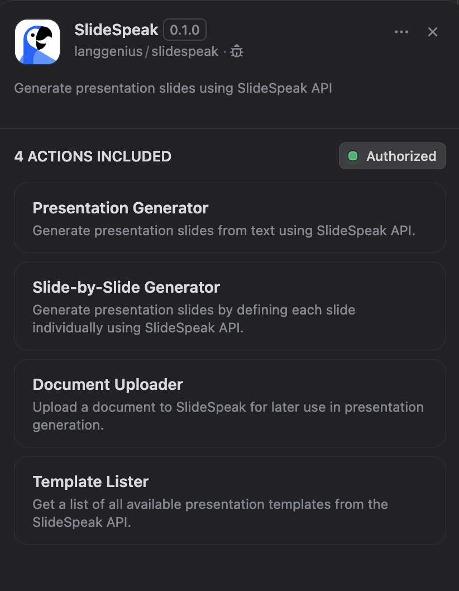

## Overview

**SlideSpeak** is a powerful tool for generating presentation slides from text.

In **Dify**, SlideSpeak streamlines the process of creating visually engaging slides based on the content you provide. Whether you're preparing for meetings, lectures, or pitches, SlideSpeak enables efficient slide creation with minimal effort.

## Configuration

To start using **SlideSpeak**, follow these steps:

1. **Install the SlideSpeak Tool** Open the Plugin Marketplace, search for the SlideSpeak tool, and install it to integrate it with your application.

2. **Get a SlideSpeak API Key** Visit the SlideSpeak platform, create a new API Key, and ensure your account has the necessary permissions to access its features.

3. **Authorize SlideSpeak** In Dify, go to **Plugins > SlideSpeak > To Authorize**. Enter your API Key to activate the tool.

## Parameter Limitations and Constraints

### General Limitations

- **API Timeout**: All requests have a 100-second timeout limit
- **Polling Interval**: Task status checks occur every 2 seconds
- **Response Formats**: Only PowerPoint (.pptx) and PDF formats are supported

### 1. Presentation Generator Constraints

**Number of Slides (length)**
- **Type**: Integer (required)
- **Limitation**: Must be a positive integer
- **Note**: No explicit upper limit specified by the API

**Template Selection**
- **Type**: Select from predefined options (required)
- **Available Templates**: 17 options
  - `default`, `gradient`, `adam`, `bruno`, `clyde`, `daniel`, `eddy`, `felix`, `iris`, `monolith`, `nexus`, `aurora`, `lavender`, `nebula`, `marina`, `monarch`, `serene`

**Language**
- **Type**: String (optional)
- **Default**: "ORIGINAL"
- **Limitation**: Must be a valid language code or "ORIGINAL"

**Tone Options**
- **Type**: Select from predefined options (optional)
- **Available Tones**: 6 options
  - `default`, `casual`, `professional`, `funny`, `educational`, `sales_pitch`

**Verbosity Levels**
- **Type**: Select from predefined options (optional)
- **Available Levels**: 3 options
  - `concise`, `standard`, `text-heavy`

**Document UUIDs**
- **Type**: JSON array of strings (optional)
- **Format**: Must be valid JSON array format
- **Limitation**: UUIDs must be from previously uploaded documents

### 2. Slide-by-Slide Generator Constraints

**Slides Definition**
- **Type**: JSON string array (required)
- **Format**: Must be valid JSON with specific structure
- **Required Fields per Slide**:
  - `title`: String
  - `layout`: Must be one of 14 predefined layouts
  - `item_amount`: Integer (critical constraint)
  - `content`: String
- **Optional Fields**:
  - `images`: Array of image URLs

**Layout-Specific Item Amount Constraints**:
- **Fixed Amounts**:
  - `pestel`: Exactly 6 items
  - `swot`: Exactly 4 items
  - `quote`: Exactly 1 item
  - `thanks`: Exactly 0 items
  - `comparison`: Exactly 2 items
- **Range Constraints**:
  - `items`: 1-5 items
  - `steps`: 3-5 items
  - `summary`: 1-5 items
  - `big-number`: 1-5 items
  - `milestone`: 3-5 items
  - `pyramid`: 1-5 items
  - `timeline`: 3-5 items
  - `funnel`: 3-5 items
  - `cycle`: 3-5 items

**Available Layouts**: 14 options
- `items`, `steps`, `summary`, `comparison`, `big-number`, `milestone`, `pestel`, `swot`, `pyramid`, `timeline`, `funnel`, `quote`, `cycle`, `thanks`

### 3. Document Uploader Constraints

**Supported File Types**
- **Formats**: `.pptx`, `.ppt`, `.docx`, `.doc`, `.xlsx`, `.pdf`
- **Input**: File object or URL string
- **Processing**: Files are processed asynchronously

**File Size Limitations**
- **Note**: No explicit file size limits are documented in the code
- **Timeout**: 100-second timeout may limit very large file uploads

### 4. Template Lister Constraints

**No Parameters Required**
- **Limitation**: No input validation needed
- **Output**: Returns all available templates with preview images

### Common Boolean Parameters

**All Boolean Parameters** (optional):
- `fetch_images`: Include stock images (default: true)
- `include_cover`: Include cover slide (default: true)
- `include_table_of_contents`: Include table of contents (default: true)
- `use_branding_logo`: Include brand logo (default: false)
- `use_branding_color`: Apply brand color (default: false)

### Error Handling

**Validation Errors**
- Invalid layout/item_amount combinations will cause validation failures
- Malformed JSON in slides parameter will be rejected
- Missing required parameters will prevent execution

**API Errors**
- Network timeouts after 100 seconds
- Invalid API key will prevent all operations
- Task failures are reported with specific error messages

## Tool Features

The **SlideSpeak** plugin includes four powerful tools to help you create presentations:

### 1. Presentation Generator

Create presentation slides from text-based topics or content with automatic slide generation.

**Input Variables:**
* **Topic or Content (Optional):** Provide the text or topic to be converted into slides.
* **Number of Slides (Required):** Specify the desired number of slides in the presentation.
* **Presentation Template (Required):** Choose the visual template for your presentation.
* **Language (Optional):** Select the language for your presentation.

### 2. Slide-by-Slide Generator

Generate presentations by defining each slide individually with full control over content and layout.

**Input Variables:**
* **Slides (Required):** A JSON array defining each slide with title, layout, item amount, and content.
* **Presentation Template (Required):** Choose the visual template for your presentation.

### 3. Document Uploader

Upload documents to SlideSpeak for later use in presentation generation.

**Input Variables:**
* **Document File (Required):** Upload files in supported formats (.pptx, .ppt, .docx, .doc, .xlsx, .pdf).

### 4. Template Lister

Get a list of all available presentation templates from the SlideSpeak API.

**No input required** - This tool retrieves all available templates with their names and preview images.

## Usage

**SlideSpeak can seamlessly integrate with Chatflow / Workflow Apps and Agent Apps.**

### Chatflow / Workflow Apps

1. Add the SlideSpeak node to your Chatflow or Workflow pipeline.
2. Choose the appropriate tool based on your needs:
   - Use **Presentation Generator** for quick slide creation from text
   - Use **Slide-by-Slide Generator** for detailed control over each slide
   - Use **Document Uploader** to upload source documents
   - Use **Template Lister** to explore available templates
3. Configure the selected tool with the required parameters.
4. Run the pipeline to generate slides and deliver them as part of your workflow.

### Agent Apps

1. Add the SlideSpeak tool to your Agent application.
2. The agent can automatically choose the most appropriate tool based on your request:
   - Ask for a presentation on a specific topic for automatic generation
   - Request detailed slide-by-slide creation for custom layouts
   - Upload documents for processing
   - List available templates for selection
3. The tool processes your input and returns the generated presentation slides or requested information.

## Use Cases

* **Quick Presentations:** Use the Presentation Generator to rapidly create slides for business meetings, academic lectures, or project pitches.
* **Custom Presentations:** Use the Slide-by-Slide Generator for detailed control over each slide's content and layout.
* **Document Processing:** Upload existing documents and convert them into presentation format.
* **Template Exploration:** Browse available templates to find the perfect design for your presentation.
* **Content Summarization:** Convert long documents or ideas into concise, well-structured slides.
* **Educational Material:** Generate slides for courses, tutorials, or workshops.
* **Idea Sharing:** Create visually engaging slides to present concepts or ideas.

With **SlideSpeak**, you can save time and effort by automating the slide creation process while maintaining full control over the presentation content and design, focusing more on delivering impactful presentations.

## Privacy

For information about data handling and privacy practices, please refer to the SlideSpeak Privacy Policy: https://slidespeak.co/privacy/

When using this plugin, your content and uploaded documents are processed by the SlideSpeak API service according to their privacy policy.
