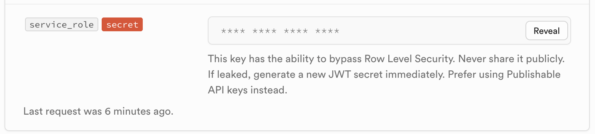
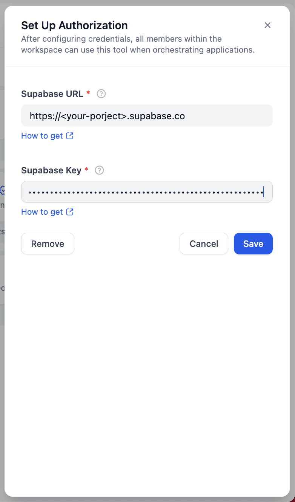
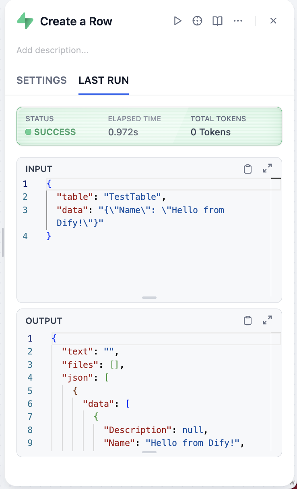

## dify-plugin-pdm-template

**Author:** langgenius

**Version:** 0.0.1

**Type:** tool

### Description

Supabase is an open-source backend-as-a-service (BaaS) that provides a real-time database, authentication, and storage built on top of PostgreSQL. This plugin enables you to interact with your Supabase project directly, allowing you to create, retrieve, update, and delete rows in your database tables through a set of easy-to-use tools.

### Tools

- **Create a Row**: Create a new row in a specified table in Supabase. You need to provide the table name and the row data as a JSON object.
- **Delete Row(s)**: Delete existing row(s) in a specified table in Supabase. You need to provide the table name and a filter condition to identify which rows to delete (e.g., 'id=1').
- **Get Rows**: Retrieve rows from a specified table in Supabase. You can specify the table name, an optional filter condition (e.g., 'status=active'), and a limit for the number of rows to return.
- **Update Row(s)**: Update existing row(s) in a specified table in Supabase. You need to provide the table name, the new row data as a JSON object, and a filter condition to identify which rows to update (e.g., 'id=1').

### Usage

1. Get your Supabase project URL and API key from your Supabase dashboard. Note that you should copy service_role API key for this plugin to ensure proper permissions.

2. Set up the plugin with your Supabase project URL and API key in Dify.

3. Use the provided tools to interact with your Supabase database:

### Privacy Policy

Please refer to the [Privacy Policy](PRIVACY.md) for details on data collection, processing, and user rights.

last updated: 2025-06-12
