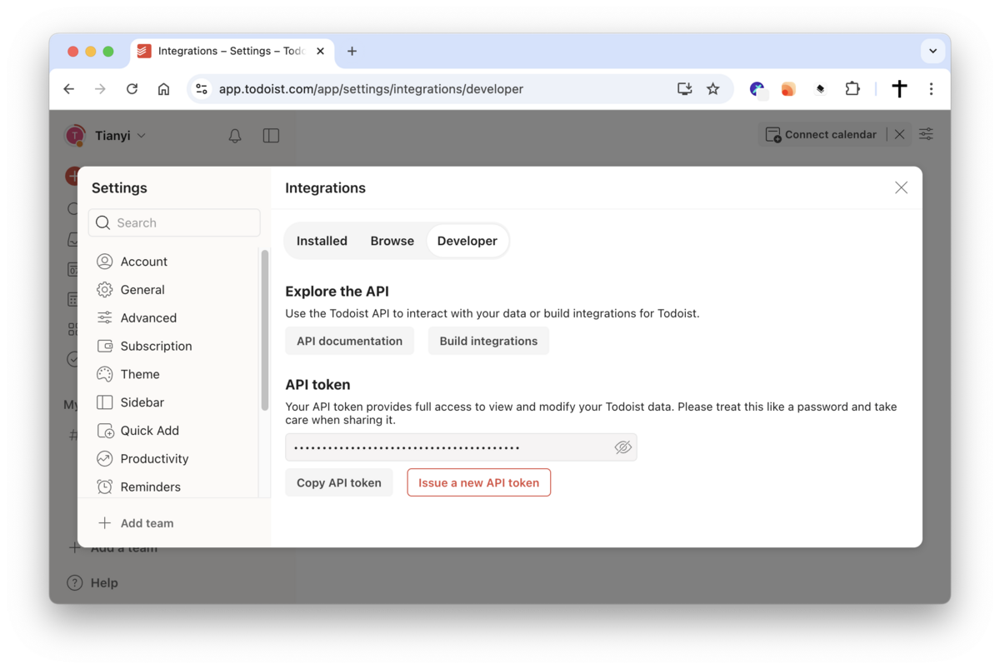
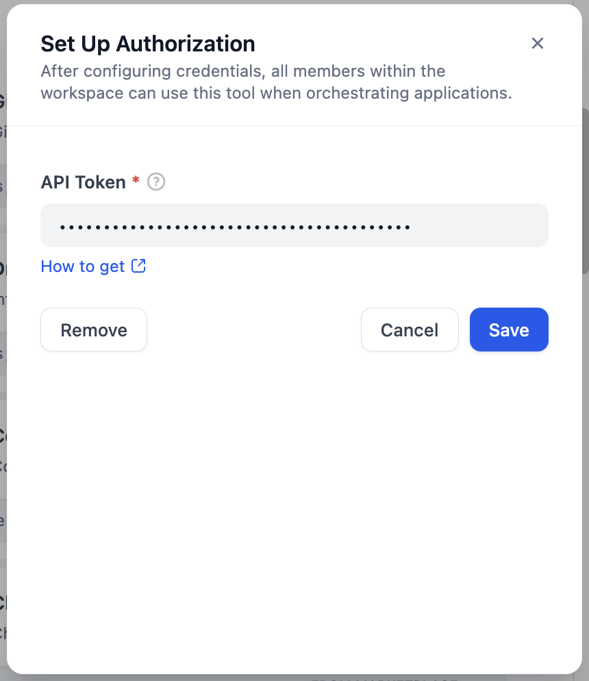
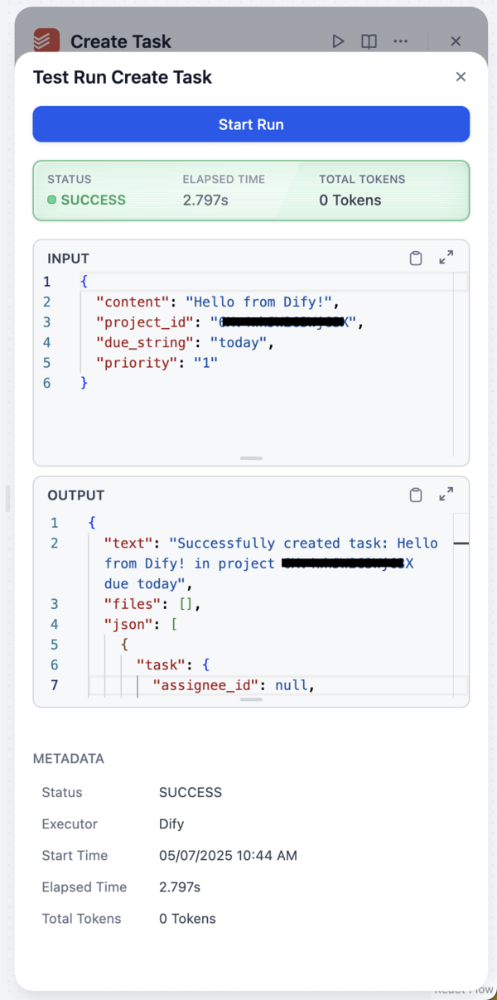
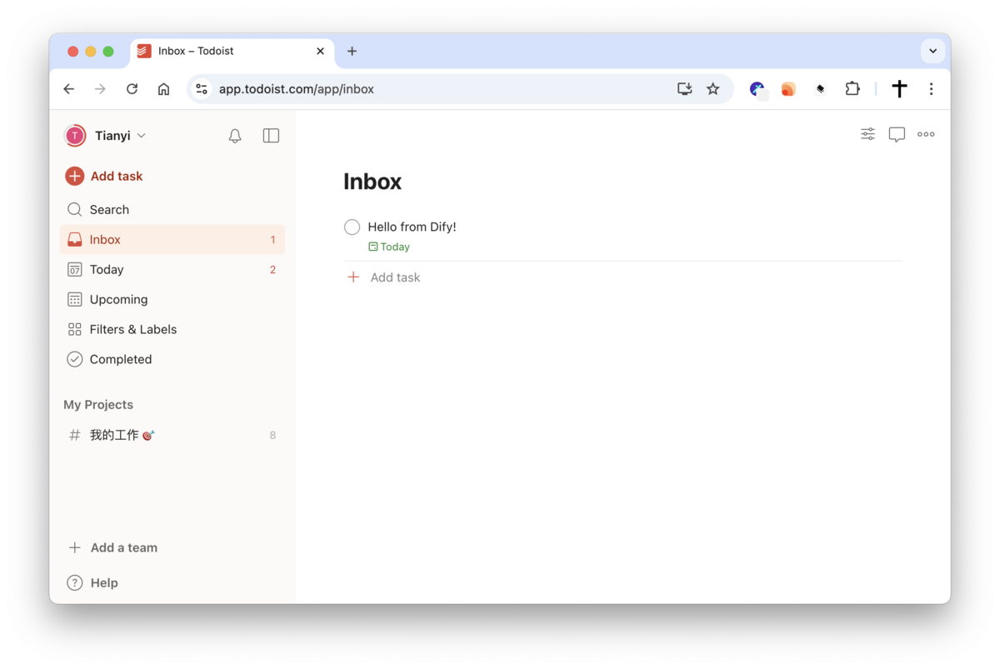

# Dify Plugin for Todoist

### Description

This Dify plugin allows you to interact with Todoist, enabling you to manage tasks and projects. The plugin is designed to seamlessly integrate Todoist's features, helping you manage your to-do list more efficiently.

### Features

This plugin provides the following functionalities:

* **Project Management:**
    * List all accessible projects (`list_projects`)
    * Retrieve details of a specific project (`get_project`)
* **Task Management:**
    * List tasks (`list_tasks`)
    * Retrieve details of a specific task (`get_task`)
    * Create a new task (`create_task`)
    * Complete a task (`complete_task`)

### Setup

1. **Obtain your Todoist API token:**
     * Log in to your Todoist account
     * Go to Settings > Integrations > Developer
     * Copy your API token (or create a new one if none exists)

2. **Configure the plugin in Dify:**
     * When adding the Todoist plugin, you will need to provide:
         * **API Token:** The API token you obtained in the previous step

3. **Start using the plugin!** You can now use Todoist tools within the Dify application.

### Privacy Policy

Refer to the [Privacy Policy](PRIVACY.md) to understand how we handle your data.
