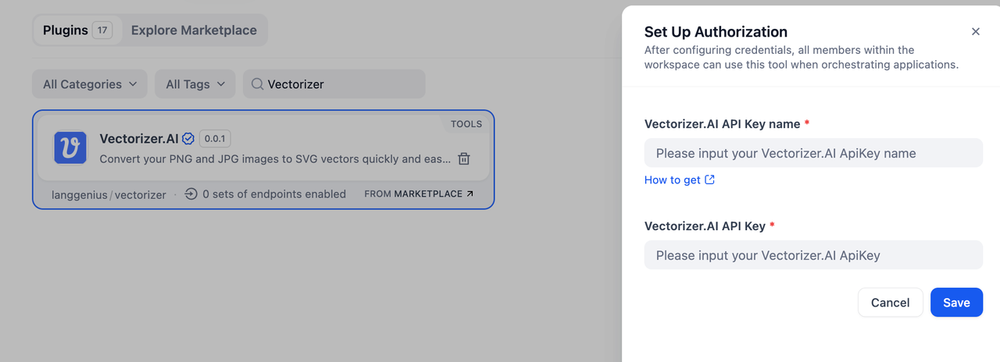
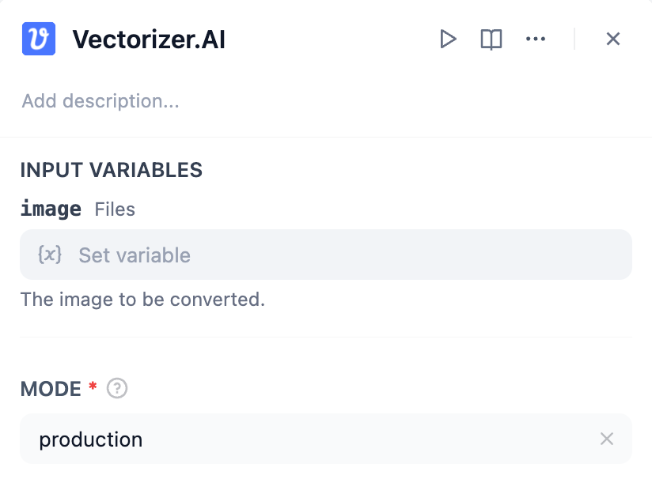
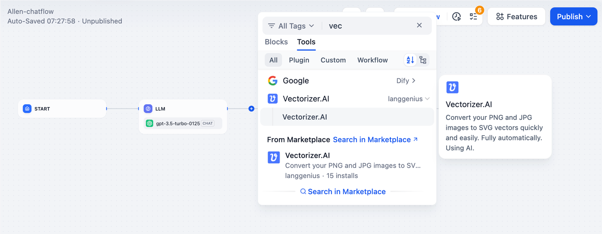
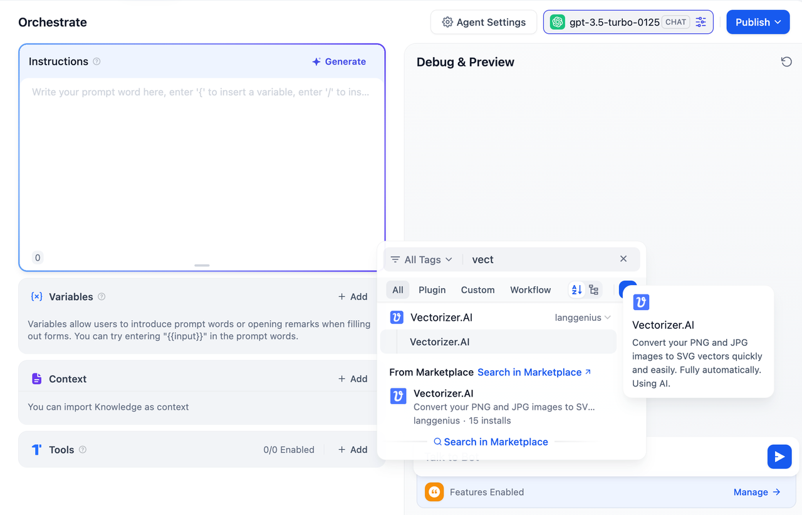

## Overview

**Vectorizer.AI** is a powerful tool that converts PNG and JPG images into scalable SVG vector graphics quickly and easily. Powered by AI, the conversion process is fully automated, allowing you to transform raster images into high-quality vector formats with minimal effort.

This tool is ideal for graphic designers, developers, and anyone who needs vectorized images for their projects.

---

## Configuration

To start using **Vectorizer.AI**, follow these steps:

1. **Install Vectorizer.AI Tool**  
   Access the Plugin Marketplace and install the Vectorizer.AI tool.

2. **Apply for a Firecrawl API Key**  
   Go to the [Vectorizer.AI API Keys](https://vectorizer.ai/api) page, create a new API Key, and ensure your account has sufficient balance.

3. **Authorize Vectorizer.AI**  
   Navigate to **Tools > Vectorizer.AI > To Authorize** in your application and provide API Key ID and Secret to activate the plugin.

## Tool Feature

When using **Vectorizer.AI**, you need to configure the following input parameters to convert your images into SVG vector files:

1. **Image** (*Files, Required*):
   - Description: The image file that you want to convert.
   - Supported Formats: PNG and JPG.
   - This field is mandatory, and the uploaded file will serve as the source for vectorization.

2. **Mode** (*String, Required*):
   - Description: Specifies the operating mode for the tool.
   - Default Value: `test`.
   - Purpose: Ensures the conversion process operates under optimal settings for high-quality output.

## Usage

### Chatflow / Workflow Apps

1. Add the **Vectorizer.AI** node to your Chatflow or Workflow pipeline.
2. Upload the image file by using file variables.
3. Execute the pipeline to generate the SVG file, which can be further processed or shared within the workflow.

### Agent Apps

1. Integrate **Vectorizer.AI** into your Agent application.
2. Provide the PNG or JPG file via the chat interface.
3. The tool processes the file and returns the converted SVG, ready for use.

